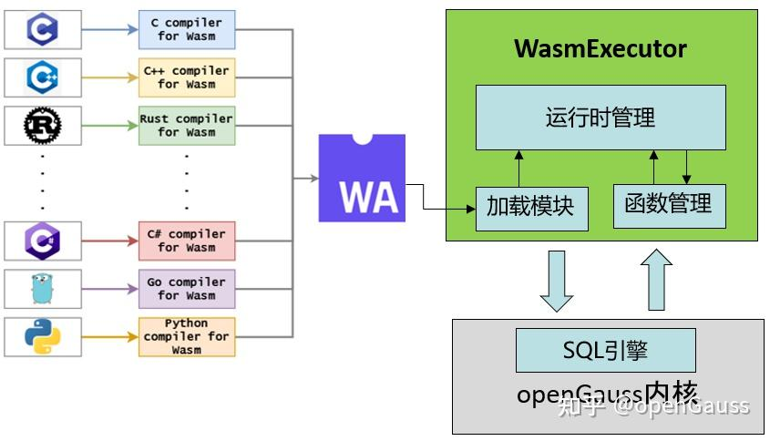
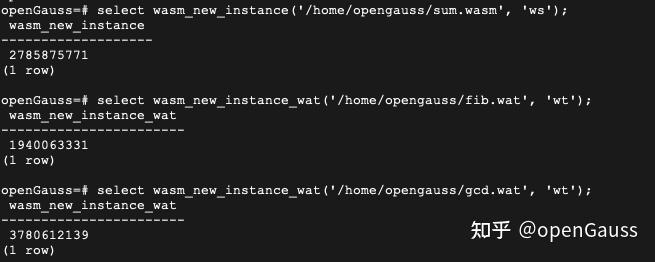
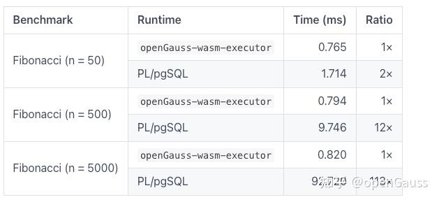

## 数据库UDF安全沙箱: wasm extension   
    
### 作者    
digoal    
    
### 日期    
2023-08-19  
    
### 标签    
PostgreSQL , PolarDB , udf , 安全 , 沙箱  
    
----    
    
## 背景    
  
使用云数据库服务例如RDS无法自定义untrusted language的存储过程和函数, 例如c, plpython3u. 原因是这类函数可以击穿数据库进程, 直达运行数据库的操作系统用户层面, 而在云服务中是不允许这种情况出现的. 原因是这样用户可以越过数据库普通用户的权限执行带来破坏性的操作, 不仅可能破坏自身数据库服务, 也可能破坏在同一台服务器的其他进程(例如管控程序).   
  
  
今天在CoC大会上认识一位基于wasm搞沙箱开源项目的朋友, 也许能解决以上云环境的安全隔离和穿透问题. 将udf运行在wasm沙箱中.  
- 运行二进制码, 可以对管理员隐藏udf内部代码
- 隔离应用与 OS，不允许应用随便调用 OS 服务
- 隔离 Wasm 应用之间，让多租户的一个 Wasm 应用不能看见别的应用的数据与状态 
  
github repo:   
- https://github.com/WasmEdge/WasmEdge
  
C API 文档:   
- https://wasmedge.org/docs/category/c-sdk-for-embedding-wasmedge
  
嵌入到 libsql 执行 UDF 的例子:   
- https://wasmedge.org/docs/embed/use-case/libsql  
   
https://wasmedge.org/  
  
我转一篇opengauss+wasm的实践, 值得参考, 对应项目: 
- https://gitee.com/opengauss/openGauss-wasm
- https://github.com/wasmerio/wasmer-postgres  
   
## 原文如下:   
  
https://zhuanlan.zhihu.com/p/621105910  
  
很多人听说 WebAssembly，或者它的简称 Wasm，可能还是由于它在浏览器中得到了广泛的应用。但是，近些年随着 Wasm 持续不断的发展，其在服务器端的应用也越来越广泛。在刚刚过去的 10 月底，Docker 发布了 Docker+Wasm 的技术预览版本，旨在为广大开发者提供一个更快速便捷地构建 Wasm 应用程序的容器环境，这一动作标志着 Wasm 在云原生领域已经得到了有效应用。那么，什么是 Wasm 呢？  
  
## WebAssemby 是什么？  
  
先来看看官方的定义：  
>>  
WebAssembly (abbreviatedWasm) is a binary instruction format for a stack-based virtual machine. Wasm is designed as a portable compilation target for programming languages, enabling deployment on the web for client and server applications.  
  
即 Wasm 是一种基于栈式虚拟机的二进制指令格式，旨在为众多编程语言提供一种可移植的编译目标，方便应用在 Web 客户端及服务器上的部署运行。  
  
Wasm 诞生之初，主要是为了解决前端在复杂业务逻辑场景下，加载和运行缓慢的问题。Wasm 格式的二进制码体积非常小，可以快速高效地分发和加载，程序执行也非常快，并且由于在设计之初抽象利用的是常见的硬件能力，因此具有非常好的移植性。此外，Wasm 的运行被限制在一个安全的沙箱环境中，因此具有很高的安全性。  
  
随着 Wasm 技术的发展，人们逐渐意识到 Wasm 的可移植、高性能和安全性等特点，在服务端的业务场景中同样具有巨大的应用价值。于是乎，2019 年，Mozilla、Fastly、Intel 以及 Red Hat 联合成立字节码联盟(BytecodeAlliance)，旨在推动 Wasm 和 WASI(WebAssembly System Interface) 的标准化，以便更好地推广和完善 Wasm 在服务端的应用场景和技术生态。  
  
为了推广和增强 Wasm 在服务端的应用，字节码联盟主导孵化了 Wasmtime 项目。该项目提供一个针对 Wasm 字节码的独立的运行时。Wasmtime 具有如下特点：  
  
- 快速。Wasmtime 基于优化 Cranelift 代码生成器构建，可在运行时或运行前快速生成高质量的机器代码。  
- 安全。Wasmtime 的开发非常注重正确性和安全性。在 Rust 运行时安全性保证的基础上，每个 Wasmtime 的特性都经过 RFC 过程的仔细审查和研究。  
- 可配置。Wasmtime 使用合理的默认值，同时提供丰富的配置项，可以针对 CPU 和内存等资源消耗进行更细粒度的控制。  
- WASI 接口丰富。Wasmtime 支持众多的 WASI 标准接口，可以很方便的和宿主机进行通信。  
- 标准兼容。Wasmtime 通过了官方的 WebAssembly 测试套件，实现了 Wasm 的官方 C API，并实现了 WebAssembly 中的众多未来特性。  
  
  
## 数据库+Wasm 的尝试  
  
  
Wasm 在诞生之初就为自己贴上了高性能和高安全的标签，而这些也是数据库系统所一直追求的。数据库系统如何融入 Wasm 技术，使其在数据库领域发挥其价值魅力，也成为了很多开发人员探索的一个方向。  
  
cunchydata 的开发人员，基于 v86 模拟器，将 PostgreSQL 整体率先成功地运行在浏览器之上，并基于此推出了 Web 上的操作平台，最终在 GitHub 上发展成一个高人气的开源项目。  
  
Wasmer 的开发人员基于 Wasmer 的运行时，使用 Rust 语言为 PostgreSQL 开发了一个 Wasm 插件，使得在 PostgreSQL 中可以成功运行 Wasm 字节码。该插件为 PostgreSQL 提供了一种运行 Wasm 创建 UDF 函数，即用户定义函数的能力，开发人员可以将自己开发的 UDF 函数编译为 Wasm 二进制后导入 PostgreSQL 中运行。该项目仅支持 PG10 版本，且在 Wasm 类型上仅支持整数类型，并且该项目已经有两年多没有更新过了。  
  
最近 SQLite 的开发人员，基于 Wasmtime 运行时，成功的为 SQLite 开发支持了 Wasm 函数的能力，并已经合入 SQLite 社区。开发人员在 SQLite 中创建了新的函数表，提供了新的创建 UDF 函数的语言 Wasm 的语法，这样用户可以直接使用 create function function_name language wasm 的形式为SQLite 增加 UDF 函数。但是该方式无法批量导入开发人员开发的 Wasm 函数，且 Wasm 语言的表现形式比较差，普通用户无法直观的理解函数签名等重要信息，不便于用户使用 Wasm 函数。在函数调用时，在确定函数不存在于 SQLite 系统中时，才会去新增的函数表中查找该函数，这样的二次查找方式也会造成部分性能损耗。  
  
## openGauss 与 Wasm 的融合  
  
  
在简单调研了 Wasm 的现状后，我们基于 Wasmtime 的运行时，为 openGauss 开发了一套独立的 UDF 函数执行引擎 WasmExecutor，下面就来详细看看这个 UDF 引擎是如何工作的。  
  
## WasmExecutor 总体架构  
  
  
  
上图便是我们设计的 UDF 执行引擎的结构图。基于 openGauss 提供的良好的扩展接口，我们插件化地实现了 Wasm 版本的 UDF 执行引擎 WasmExecutor，这种插件化方式可以避免对 openGauss 内核代码的侵入修改，保持版本的独立演进。  
  
如结构图所示，开发人员可以使用自己喜欢的编程语言来设计开发 UDF 函数，开发完成后将函数编译为 Wasm 形式的二进制目标码，就可以通过 WasmExecutor 引擎提供的能力将 UDF 函数集成到 openGauss 数据库中。在此之后，用户便可以像使用内置函数一样，使用新增的 UDF 函数了。  
  
为了实现将 Wasm 文件中的函数导入到 openGauss 的能力，我们开发了加载模块。该模块提供两个函数 `wasm_new_instance(absolutepath: text, namespace: text)` 和 `wasm_new_instance_wat(absolutepath: text, namespace: text)`，其中第一个参数用来指定待导入 Wasm 文件的绝对路径，第二个参数用来指定函数将导入的名称空间。之所以设置第二个参数，是方便人们进行函数管理，避免函数名称冲突，最终用户在 SQL 调用时提供的函数名称为 namespace_funcname 的新名称。顾名思义，Wat 后缀的加载函数用来加载 Wat 格式的函数文件。加载模块会对提供的 Wasm 文件进行基本效验，然后调用 Wasm 的 runtime 接口来加载解析 Wasm 文件，将解析结果保存在运行时管理中。  
  
运行时管理主要实现加载到内存中 Wasm 文件的管理工作，并且为每个加载的 Wasm 文件，基于文件绝对路径计算一个哈希值，作为该文件的 uuid 使用。运行时管理提供名为 wasm.instances 的元信息表，用户可以查询该表获得当前系统中创建的 wasm 实例信息。  
  
函数管理模块主要实现 Wasm 文件中导出的函数与 openGauss 内核的绑定，每一个 Wasm 导出函数都会绑定到对应的公共接口上，以便用户通过 SQL 语法可以直接调用。函数管理模块提供名为 `wasm.exported_functions` 的元信息表，用户可以查询该表获取当前系统中已经导出的 Wasm 函数信息。  
  
下图所示即为调用加载函数加载新的 Wasm 文件时的流程示意图。  
  
  
  
  
  
  
  
## 实操演示  
下面我们实际操作下，如何通过 WasmExecutor 引擎来加载执行 Wasm 格式的 UDF 函数。为了方便伙伴们快速体验，我们提供了支持 WasmExecutor 引擎的容器镜像，发布于 opengaussofficial 组织下，大家可以通过以下方式获取和运行该容器镜像  
  
```  
docker pull opengaussofficial/opengauss-wasmtime:0.1.0  
docker run -it opengaussofficial/opengauss-wasmtime:0.1.0  
```  
  
容器启动成功后，登录 openGauss 数据库，创建 WasmExecutor 引擎，如下：  
  
  
  
  
  
在容器镜像中，我们默认内置了一些 Wasm 和 Wat 格式的示例文件，供伙伴们快速上手体验，这些文件放置于 `/home/opengauss` 路径下，如下所示  
  
  
  
  
如下，我们使用 `wasm_new_instance` 和 `wasm_new_instance_wat` 来分别加载 sum.wasm 和 fib.wat 中的函数，在加载函数文件时，提供函数放置的名称空间 namespace，方便进行函数管理，最终注册到 openGauss 系统表中的函数名称将会是 namespace_funcname 的新名称。  
  
  
  
  
  
查询 WasmExecutor 引擎提供的元信息表，可以直观地看到当前系统中存在的 Wasm 实例信息和导出的 Wasm 函数信息：  
  
  
  
  
  
可以看到，通过 `wasm.exported_functions` 元信息表，可以方便地查询导出的函数签名，方便函数调用者使用，导出的函数和 openGauss 内置的函数一样，支持使用原生 SQL 来调用，如下所示：  
  
  
  
  
  
## 性能测试对比  
为了对 Wasm 的执行性能做一个直观的展示，我们在一台 4U 8G 的云虚拟机上进行了简单的性能测试。我们使用 Wasm 和 pl/pgsql 分别进行斐波那契数列的计算，测得的结果如下所示。  
  
  
  
  
  
可以看出，即便在计算量比较小的场景下，Wasm 的执行性能也明显优于 pl/pgsql，随着计算量的增长，Wasm 的执行性能已经远远高于 pl/pgsql。由此可以看出，Wasm 在计算密集型的数据库应用场景下具有非常吸引人的应用潜力。  
  
## 未来展望  
Wasm 技术正在如火如荼的发展着，随着 WASI 接口的不断丰富和完善，其在服务端的应用能力也将越来越成熟。openGauss 作为领先的企业级数据库，未来也将持续不断的跟进和融合 Wasm 的发展成果，提升 openGauss 数据库的安全性和性能。  
  
目前提供的 openGauss+Wasm 的能力版本还只是个原型版本，项目还在努力开发中，后续将会支持更多的数据类型和数据库操作能力，希望更多感兴趣的小伙伴能够加入我们，与我们一起打造领先的数据库引擎。  
  
## 参考链接  
- https://webassembly.org/  
- https://bytecodealliance.org/  
- https://www.crunchydata.com/blog/crazy-idea-to-postgres-in-the-web-browser  
- https://www.crunchydata.com/developers/playground  
- https://github.com/snaplet/postgres-wasm  
- https://github.com/libsql/libsql  
- https://gitee.com/opengauss/openGauss-wasm  
  
  
#### [期望 PostgreSQL|开源PolarDB 增加什么功能?](https://github.com/digoal/blog/issues/76 "269ac3d1c492e938c0191101c7238216")
  
  
#### [PolarDB 云原生分布式开源数据库](https://github.com/ApsaraDB "57258f76c37864c6e6d23383d05714ea")
  
  
#### [PolarDB 学习图谱: 训练营、培训认证、在线互动实验、解决方案、内核开发公开课、生态合作、写心得拿奖品](https://www.aliyun.com/database/openpolardb/activity "8642f60e04ed0c814bf9cb9677976bd4")
  
  
#### [PostgreSQL 解决方案集合](../201706/20170601_02.md "40cff096e9ed7122c512b35d8561d9c8")
  
  
#### [德哥 / digoal's github - 公益是一辈子的事.](https://github.com/digoal/blog/blob/master/README.md "22709685feb7cab07d30f30387f0a9ae")
  
  

  
