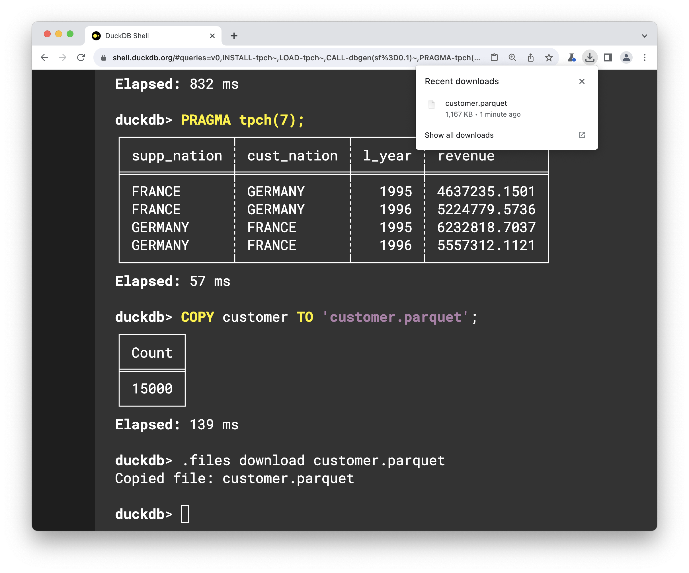
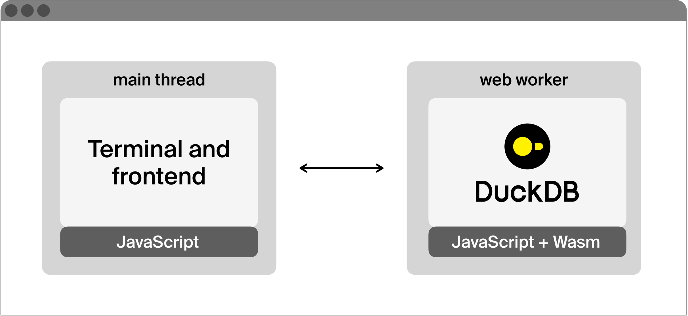
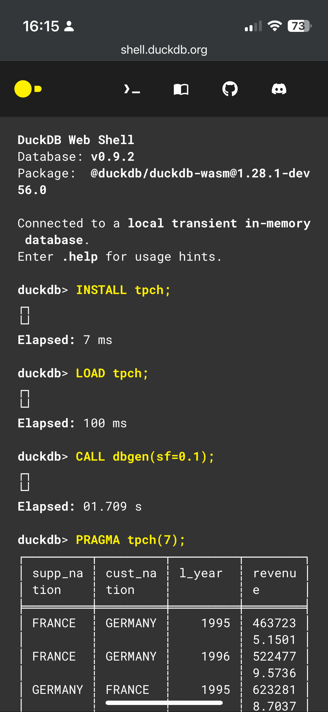

## 在WEB浏览器中运行数据库: DuckDB-WASM 与 extension   
                                                  
### 作者                                                  
digoal                                                  
                                                  
### 日期                                                  
2024-01-23                                            
                                                  
### 标签                                                  
PostgreSQL , PolarDB , DuckDB , WASM , web , 浏览器 , 插件          
                                                  
----                                                  
                                                  
## 背景    
大量内容翻译自: https://duckdb.org/2023/12/18/duckdb-extensions-in-wasm.html  
  
TL;DR：DuckDB-Wasm 用户现在可以加载 DuckDB 扩展，从而允许他们在浏览器中运行扩展。  
  
在这篇博文中，我们将介绍两个令人兴奋的 DuckDB 功能：DuckDB-Wasm 客户端和 DuckDB 扩展。我将讨论这些不相交的功能现在如何适应在一起工作。这些功能现在可供 DuckDB-Wasm 用户使用，您可以在 shell.duckdb.org 上试用它们。  
  
## DuckDB 扩展  
DuckDB的理念是拥有一个精益的核心系统来确保健壮性和可移植性。然而，一个相互竞争的设计目标是灵活并允许执行高级分析所需的广泛功能。为了适应这一点，DuckDB 有一个扩展机制，用于在运行时安装和加载扩展。  
  
### 本地运行 DuckDB 扩展  
[对于 DuckDB，这是一个使用命令行](https://duckdb.org/docs/api/cli)界面的简单端到端示例：  
```  
INSTALL tpch;  
LOAD tpch;  
CALL dbgen(sf=0.1);  
PRAGMA tpch(7);  
```  
  
该脚本首先从官方扩展存储库安装[TPC-H 扩展](https://duckdb.org/docs/extensions/tpch)，该扩展实现了流行的 TPC-H 基准测试。然后，它加载 TPC-H 扩展，使用该扩展使用该函数生成的数据填充数据库dbgen。最后，它运行[TPC-H 查询 7](https://github.com/duckdb/duckdb/blob/v0.9.2/extension/tpch/dbgen/queries/q07.sql)。  
  
此示例演示了我们安装扩展来补充 DuckDB 的新功能（TPC-H 数据生成器）的情况，该扩展不是基本 DuckDB 可执行文件的一部分。相反，它是从扩展存储库下载的，然后在 DuckDB 框架内本地加载并执行。  
  
目前，DuckDB有[多个扩展](https://duckdb.org/docs/extensions/official_extensions)。这些增加了对文件系统、文件格式、数据库和网络协议的支持。此外，它们还实现了全文搜索等新功能。  
  
## DuckDB-Wasm  
在 André Kohn 的带领下， DuckDB于 2021 年移植到 [WebAssembly 平台](https://duckdb.org/2021/10/29/duckdb-wasm.html)。 [WebAssembly](https://webassembly.org/)也称为 Wasm，是近年来开发的 W3C 标准语言。将其视为一种独立于机器的二进制格式，您可以在 Web 浏览器的沙箱中执行它。  
  
借助 DuckDB-Wasm，任何人都只需通过浏览器选项卡即可访问 DuckDB 实例，所有计算都在浏览器本地执行，并且没有数据离开您的设备。DuckDB-Wasm 是一个可用于各种部署的库（例如，[在浏览器内运行的笔记本，无需服务器](https://observablehq.com/@cmudig/duckdb)）。在这篇文章中，我们将使用 Web shell，其中用户逐行输入 SQL 语句，其行为模仿 [DuckDB CLI shell](https://duckdb.org/docs/api/cli)。  
  
## DuckDB 扩展，在 DuckDB-Wasm 中！  
DuckDB-Wasm[现在支持 DuckDB 扩展](https://duckdb.org/docs/api/wasm/extensions)。此支持附带四个新的关键功能。首先，DuckDB-Wasm 库可以通过动态扩展支持进行编译。其次，DuckDB 扩展可以编译为单个 WebAssembly 模块。第三，使用 DuckDB-Wasm 的用户和开发人员现在可以选择他们加载的扩展集。最后，DuckDB-Wasm shell 的功能现在更接近本机[CLI 功能](https://duckdb.org/docs/api/cli)。  
  
### 在 DuckDB-Wasm 中使用 TPC-H 扩展  
为了演示这一点，我们将再次使用[TPC-H 数据生成示例](https://duckdb.org/2023/12/18/duckdb-extensions-in-wasm.html#running-duckdb-extensions-locally)。要在浏览器中运行此脚本，请启动运行这些命令的[在线 DuckDB shell](https://shell.duckdb.org/#queries=v0,INSTALL-tpch~,LOAD-tpch~,CALL-dbgen(sf%3D0.1)~,PRAGMA-tpch(7)~)。该脚本将以比例因子 0.1 生成 TPC-H 数据集，相当于未压缩的 CSV 格式的 100MB。  
  
脚本完成后，您可以继续执行查询，甚至可以customer.parquet使用以下命令下载文件 (1MB)：  
```  
COPY customer TO 'customer.parquet';  
.files download customer.parquet  
```  
  
这将首先将其复制`customer.parquet`到 DuckDB-Wasm 文件系统，然后通过浏览器下载它。  
  
简而言之，您的 DuckDB 实例完全在浏览器中运行，首先安装并加载了[TPC-H 扩展](https://duckdb.org/docs/extensions/tpch)。然后，它使用扩展逻辑生成数据并将其转换为 Parquet 文件。最后，您可以将 Parquet 文件作为常规文件下载到本地文件系统。  
  
[](https://shell.duckdb.org/#queries=v0,INSTALL-tpch~,LOAD-tpch~,CALL-dbgen(sf%3D0.1)~,PRAGMA-tpch(7)~)    
  
  
### 使用 DuckDB-Wasm 中的空间扩展  
为了展示 DuckDB-Wasm 扩展所释放的可能性并测试可能的功能，在 DuckDB-Wasm 中使用[空间扩展](https://duckdb.org/docs/extensions/spatial)怎么样？此扩展实现了地理空间类型和函数，使其能够处理地理空间数据和相关工作负载。  
  
要在 DuckDB-Wasm 中安装并加载空间扩展，请运行：  
```  
INSTALL spatial;  
LOAD spatial;  
```  
  
通过空间扩展，以下查询使用纽约出租车数据集，并计算每个行政区的出租车区域面积：  
```  
CREATE TABLE nyc AS  
    SELECT  
        borough,  
        st_union_agg(geom) AS full_geom,  
        st_area(full_geom) AS area,  
        st_centroid(full_geom) AS centroid,  
        count(*) AS count FROM  
st_read('https://raw.githubusercontent.com/duckdb/duckdb_spatial/main/test/data/nyc_taxi/taxi_zones/taxi_zones.shp')  
GROUP BY borough;  
SELECT borough, area, centroid::VARCHAR, count  
FROM nyc;  
```  
  
您的本地 DuckDB 客户端和在线 DuckDB shell都将执行相同的分析。  
  
## [under the hood](https://duckdb.org/2023/12/18/duckdb-extensions-in-wasm.html#under-the-hood)  
让我们深入研究一下这一切是如何运作的。下图展示了DuckDB-Wasm的架构概览。图中的两个组件都在 Web 浏览器中运行。  
  
DuckDB-Wasm架构概述  
  
  
当您在浏览器中加载 DuckDB-Wasm 时，将设置两个组件： (1) 主线程包装库，充当使用 DuckDB-Wasm 的用户或代码之间的桥梁并驱动后台组件。(2) 用于执行查询的DuckDB引擎。该组件位于 Web Worker 中，并通过消息与主线程组件进行通信。该组件有一个 JavaScript 层，用于处理消息和编译为单个 WebAssembly 文件的原始 DuckDB C++ 逻辑。  
  
当我们添加扩展时会发生什么？  
  
带扩展的 DuckDB-Wasm 架构概述  
  
  
DuckDB-Wasm 的扩展由单个 WebAssembly 模块组成。这将对扩展的逻辑和数据、将要导入和导出的函数列表以及允许验证扩展的编码元数据的自定义部分进行编码。  
  
为了使扩展加载工作，DuckDB 引擎组件会阻止、获取和验证外部 WebAssembly 代码，然后将其链接起来，将导入和导出连接在一起，然后系统将被连接并设置为继续执行，就好像它是单个代码库一样。  
  
使这成为可能的中心代码块如下：  
```  
EM_ASM(  
    {  
        const xhr = new XMLHttpRequest();  
        xhr.open("GET", UTF8ToString($0), false);  
        xhr.responseType = "arraybuffer";  
        xhr.send(null);  
        var uInt8Array = xhr.response;  
        // Check signatures / version compatibility left as an exercise  
        WebAssembly.validate(uInt8Array);  
        // Here we add the uInt8Array to Emscripten's filesystem,  
        // for it to be found by dlopen  
        FS.writeFile(UTF8ToString($1), new Uint8Array(uInt8Array));  
    },  
    filename.c_str(), basename.c_str()  
);  
  
auto lib_hdl = dlopen(basename.c_str(), RTLD_NOW | RTLD_LOCAL);  
if (!lib_hdl) {  
    throw IOException(  
      "Extension \"%s\" could not be loaded: %s",  
      filename,  
      GetDLError()  
    );  
}  
```  
  
在这里，我们依赖[Emscripten](https://emscripten.org/)的两个强大功能，我们使用 Emscripten 编译器工具链将 DuckDB 编译为 WebAssembly。  
  
首先，EM_ASM允许我们直接在 C++ 代码中内联 JavaScript 代码。这意味着在运行时，当我们到达该代码块时，WebAssembly 组件将返回 JavaScript 区域，XMLHttpRequest对 URL 执行阻塞，例如[https://extensions.duckdb.org/…/tpch.duckdb_extension.wasm](https://extensions.duckdb.org/duckdb-wasm/v0.9.2/wasm_eh/tpch.duckdb_extension.wasm)，然后验证刚刚获取的包实际上是一个有效的 WebAssembly 模块。  
  
其次，我们利用 Emscripten 的[dlopen实现](https://emscripten.org/docs/compiling/Dynamic-Linking.html)，它使兼容的 WebAssembly 模块能够链接在一起并充当单个可组合的代码库。  
  
当通过 SQL 语句触发时，这些可以实现扩展的动态加载LOAD。  
  
## 开发者指南  
我们看到两个主要的开发人员群体使用 DuckDB-Wasm 的扩展。  
  
- 使用 DuckDB-Wasm 的开发人员：如果您正在构建一个包含 DuckDB-Wasm 的网站或库，新的扩展支持意味着现在可以向您的用户公开更广泛的功能。  
- 致力于 DuckDB 扩展的开发人员：如果您已经编写了 DuckDB 扩展，或者正在考虑这样做，请考虑将其移植到 DuckDB-Wasm。DuckDB[扩展模板存储库](https://github.com/duckdb/extension-template)包含编译为 DuckDB-Wasm 所需的配置。  
  
## 局限性  
DuckDB-Wasm 扩展有一些固有的限制。例如，无法与计算机上的本机可执行文件进行通信，而某些扩展（例如外部数据访问[postgres扩展](https://duckdb.org/docs/extensions/postgres)）需要进行通信。此外，您所依赖的某些库当前可能不支持 Wasm 编译，或者由于对浏览器施加的额外要求，特别是围绕[非安全 HTTP 请求](https://duckdb.org/docs/api/wasm/extensions#httpfs)，功能可能无法与本地可执行文件一对一。  
  
## 结论  
在这篇博文中，我们解释了 DuckDB-Wasm 如何支持扩展，并演示了多个扩展：[TPC-H](https://duckdb.org/docs/extensions/tpch)、[Parquet](https://duckdb.org/docs/extensions/parquet)和[Spatial](https://duckdb.org/docs/extensions/spatial)。  
  
由于 DuckDB 的可移植性，本博文中显示的脚本也可以在您的智能手机上运行：    
  
在 iOS 上使用 TPC-H 扩展的 Wasm shell  
  
  
## 补充一些内容  
DuckDB shell的快捷命令  
```  
duckdb> .help  
  
Commands:  
.clear                 Clear the shell.  
.examples              Example queries.  
.features              Shell features.  
.files list            List all files.  
.files add             Add files.  
.files download $FILE  Download a file.  
.files drop            Drop all files.  
.files drop $FILE      Drop a single file.  
.files track $FILE     Collect file statistics.  
.files paging $FILE    Show file paging.  
.files reads $FILE     Show file reads.  
.open $FILE            Open database file.  
.reset                 Reset the shell.  
.timer on|off          Turn query timer on or off.  
.output on|off         Print results on or off.  
  
Repositories:  
   https://github.com/duckdb/duckdb  
   https://github.com/duckdb/duckdb-wasm  
  
Feedback:  
   https://github.com/duckdb/duckdb-wasm/discussions  
```  
  
列出wasm duckdb中的文件  
```  
duckdb> .files list  
┌──────────────────┬───────────┬──────────┬────────────┐  
│ File Name        ┆ File Size ┆ Protocol ┆ Statistics │  
╞══════════════════╪═══════════╪══════════╪════════════╡  
│ customer.parquet ┆ 11.9 MB   ┆ Buffer   ┆ false      │  
└──────────────────┴───────────┴──────────┴────────────┘  
```  
  
列出tpch相关函数  
```  
duckdb> select function_name from duckdb_functions() where function_name like '%tpch%';  
┌───────────────┐  
│ function_name │  
╞═══════════════╡  
│ tpch_queries  │  
│ tpch_answers  │  
│ tpch          │  
└───────────────┘  
```  
  
tpch 的sql  
```  
duckdb> select * from tpch_queries();  
┌──────────┬────────────────────────────────────────────────────────────────────────────────────────────────────┐  
│ query_nr ┆ query                                                                                              │  
╞══════════╪════════════════════════════════════════════════════════════════════════════════════════════════════╡  
│        1 ┆ SELECT                                                                                             │  
│          ┆     l_returnflag,                                                                                  │  
│          ┆     l_linestatus,                                                                                  │  
│          ┆     sum(l_quantity) AS sum_qty,                                                                    │  
│          ┆     sum(l_extendedprice) AS sum_base_price,                                                        │  
│          ┆     sum(l_extendedprice * (1 - l_discount)) AS sum_disc_price,                                     │  
│          ┆     sum(l_extendedprice * (1 - l_discount) * (1 + l_tax)) AS sum_charge,                           │  
│          ┆     avg(l_quantity) AS avg_qty,                                                                    │  
│          ┆     avg(l_extendedprice) AS avg_price,                                                             │  
│          ┆     avg(l_discount) AS avg_disc,                                                                   │  
│          ┆     count(*) AS count_order                                                                        │  
│          ┆ FROM                                                                                               │  
│          ┆     lineitem                                                                                       │  
│          ┆ WHERE                                                                                              │  
│          ┆     l_shipdate <= CAST('1998-09-02' AS date)                                                       │  
│          ┆ GROUP BY                                                                                           │  
│          ┆     l_returnflag,                                                                                  │  
│          ┆     l_linestatus                                                                                   │  
│          ┆ ORDER BY                                                                                           │  
│          ┆     l_returnflag,                                                                                  │  
│          ┆     l_linestatus;                                                                                  │  
│          ┆                                                                                                    │  
│        2 ┆ SELECT                                                                                             │  
│          ┆     s_acctbal,                                                                                     │  
│          ┆     s_name,                                                                                        │  
│          ┆     n_name,                                                                                        │  
│          ┆     p_partkey,                                                                                     │  
│          ┆     p_mfgr,                                                                                        │  
│          ┆     s_address,                                                                                     │  
│          ┆     s_phone,                                                                                       │  
│          ┆     s_comment                                                                                      │  
│          ┆ FROM                                                                                               │  
│          ┆     part,                                                                                          │  
│          ┆     supplier,                                                                                      │  
│          ┆     partsupp,                                                                                      │  
│          ┆     nation,                                                                                        │  
│          ┆     region                                                                                         │  
│          ┆ WHERE                                                                                              │  
│          ┆     p_partkey = ps_partkey                                                                         │  
│          ┆     AND s_suppkey = ps_suppkey                                                                     │  
│          ┆     AND p_size = 15                                                                                │  
│          ┆     AND p_type LIKE '%BRASS'                                                                       │  
│          ┆     AND s_nationkey = n_nationkey                                                                  │  
│          ┆     AND n_regionkey = r_regionkey                                                                  │  
│          ┆     AND r_name = 'EUROPE'                                                                          │  
│          ┆     AND ps_supplycost = (                                                                          │  
│          ┆         SELECT                                                                                     │  
│          ┆             min(ps_supplycost)                                                                     │  
│          ┆         FROM                                                                                       │  
│          ┆             partsupp,                                                                              │  
│          ┆             supplier,                                                                              │  
│          ┆             nation,                                                                                │  
│          ┆             region                                                                                 │  
│          ┆         WHERE                                                                                      │  
│          ┆             p_partkey = ps_partkey                                                                 │  
│          ┆             AND s_suppkey = ps_suppkey                                                             │  
│          ┆             AND s_nationkey = n_nationkey                                                          │  
│          ┆             AND n_regionkey = r_regionkey                                                          │  
│          ┆             AND r_name = 'EUROPE')                                                                 │  
│          ┆ ORDER BY                                                                                           │  
│          ┆     s_acctbal DESC,                                                                                │  
│          ┆     n_name,                                                                                        │  
│          ┆     s_name,                                                                                        │  
│          ┆     p_partkey                                                                                      │  
│          ┆ LIMIT 100;                                                                                         │  
│          ┆                                                                                                    │  
│          ┆  .................................                                                                 │  
│       22 ┆ SELECT                                                                                             │  
│          ┆     cntrycode,                                                                                     │  
│          ┆     count(*) AS numcust,                                                                           │  
│          ┆     sum(c_acctbal) AS totacctbal                                                                   │  
│          ┆ FROM (                                                                                             │  
│          ┆     SELECT                                                                                         │  
│          ┆         substring(c_phone FROM 1 FOR 2) AS cntrycode,                                              │  
│          ┆         c_acctbal                                                                                  │  
│          ┆     FROM                                                                                           │  
│          ┆         customer                                                                                   │  
│          ┆     WHERE                                                                                          │  
│          ┆         substring(c_phone FROM 1 FOR 2) IN ('13', '31', '23', '29', '30', '18', '17')              │  
│          ┆         AND c_acctbal > (                                                                          │  
│          ┆             SELECT                                                                                 │  
│          ┆                 avg(c_acctbal)                                                                     │  
│          ┆             FROM                                                                                   │  
│          ┆                 customer                                                                           │  
│          ┆             WHERE                                                                                  │  
│          ┆                 c_acctbal > 0.00                                                                   │  
│          ┆                 AND substring(c_phone FROM 1 FOR 2) IN ('13', '31', '23', '29', '30', '18', '17')) │  
│          ┆             AND NOT EXISTS (                                                                       │  
│          ┆                 SELECT                                                                             │  
│          ┆                     *                                                                              │  
│          ┆                 FROM                                                                               │  
│          ┆                     orders                                                                         │  
│          ┆                 WHERE                                                                              │  
│          ┆                     o_custkey = c_custkey)) AS custsale                                            │  
│          ┆ GROUP BY                                                                                           │  
│          ┆     cntrycode                                                                                      │  
│          ┆ ORDER BY                                                                                           │  
│          ┆     cntrycode;                                                                                     │  
│          ┆                                                                                                    │  
└──────────┴────────────────────────────────────────────────────────────────────────────────────────────────────┘  
```  
  
安装tpcds插件  
```  
duckdb> load 'tpcds';  
```  
  
查询tpcds相关的sql  
```  
duckdb> select * from tpcds_queries();  
```  
  
查询tpch tpcds数据生成相关函数  
```  
duckdb> select * from duckdb_functions() where function_name like '%gen%';  
┌────────┬──────┬──────────────┬────────┬──────────────┬──────────────┬──────────────┬──────────────┬─────────┬──────────────┬───────┬──────────┬──────┬──────────────┐  
│ databa ┆ sche ┆ function_nam ┆ functi ┆ description  ┆ return_type  ┆ parameters   ┆ parameter_ty ┆ varargs ┆ macro_defini ┆ has_s ┆ internal ┆ func ┆ example      │  
│ se_nam ┆ ma_n ┆ e            ┆ on_typ ┆              ┆              ┆              ┆ pes          ┆         ┆ tion         ┆ ide_e ┆          ┆ tion ┆              │  
│ e      ┆ ame  ┆              ┆ e      ┆              ┆              ┆              ┆              ┆         ┆              ┆ ffect ┆          ┆ _oid ┆              │  
│        ┆      ┆              ┆        ┆              ┆              ┆              ┆              ┆         ┆              ┆ s     ┆          ┆      ┆              │  
╞════════╪══════╪══════════════╪════════╪══════════════╪══════════════╪══════════════╪══════════════╪═════════╪══════════════╪═══════╪══════════╪══════╪══════════════╡  
│ system ┆ main ┆ dsdgen       ┆ table  ┆              ┆              ┆ [schema,     ┆ [VARCHAR,    ┆         ┆              ┆       ┆     true ┆ 1363 ┆              │  
│        ┆      ┆              ┆        ┆              ┆              ┆ suffix,      ┆ VARCHAR,     ┆         ┆              ┆       ┆          ┆      ┆              │  
│        ┆      ┆              ┆        ┆              ┆              ┆ catalog,     ┆ VARCHAR,     ┆         ┆              ┆       ┆          ┆      ┆              │  
│        ┆      ┆              ┆        ┆              ┆              ┆ keys,        ┆ BOOLEAN,     ┆         ┆              ┆       ┆          ┆      ┆              │  
│        ┆      ┆              ┆        ┆              ┆              ┆ overwrite,   ┆ BOOLEAN,     ┆         ┆              ┆       ┆          ┆      ┆              │  
│        ┆      ┆              ┆        ┆              ┆              ┆ sf]          ┆ DOUBLE]      ┆         ┆              ┆       ┆          ┆      ┆              │  
│ system ┆ main ┆ dbgen        ┆ table  ┆              ┆              ┆ [step,       ┆ [UINTEGER,   ┆         ┆              ┆       ┆     true ┆ 1005 ┆              │  
│        ┆      ┆              ┆        ┆              ┆              ┆ children,    ┆ UINTEGER,    ┆         ┆              ┆       ┆          ┆      ┆              │  
│        ┆      ┆              ┆        ┆              ┆              ┆ schema,      ┆ VARCHAR,     ┆         ┆              ┆       ┆          ┆      ┆              │  
│        ┆      ┆              ┆        ┆              ┆              ┆ suffix,      ┆ VARCHAR,     ┆         ┆              ┆       ┆          ┆      ┆              │  
│        ┆      ┆              ┆        ┆              ┆              ┆ catalog,     ┆ VARCHAR,     ┆         ┆              ┆       ┆          ┆      ┆              │  
│        ┆      ┆              ┆        ┆              ┆              ┆ overwrite,   ┆ BOOLEAN,     ┆         ┆              ┆       ┆          ┆      ┆              │  
│        ┆      ┆              ┆        ┆              ┆              ┆ sf]          ┆ DOUBLE]      ┆         ┆              ┆       ┆          ┆      ┆              │  
└────────┴──────┴──────────────┴────────┴──────────────┴──────────────┴──────────────┴──────────────┴─────────┴──────────────┴───────┴──────────┴──────┴──────────────┘  
```  
  
调用某一条tpcds sql  
```  
duckdb> pragma tpcds(10);  
┌───────────┬───┬─────────────────────────────────────────────────────────────────┬──────┬──────┬──────┬───────────┬──────┬──────────────┬──────┬───┬──────┬───┬──────┐  
│ cd_gender ┆ c ┆ cd_education_status                                             ┆ cnt1 ┆ cd_p ┆ cnt2 ┆ cd_credit ┆ cnt3 ┆ cd_dep_count ┆ cnt4 ┆ c ┆ cnt5 ┆ c ┆ cnt6 │  
│           ┆ d ┆                                                                 ┆      ┆ urch ┆      ┆ _rating   ┆      ┆              ┆      ┆ d ┆      ┆ d ┆      │  
│           ┆ _ ┆                                                                 ┆      ┆ ase_ ┆      ┆           ┆      ┆              ┆      ┆ _ ┆      ┆ _ ┆      │  
│           ┆ m ┆                                                                 ┆      ┆ esti ┆      ┆           ┆      ┆              ┆      ┆ d ┆      ┆ d ┆      │  
│           ┆ a ┆                                                                 ┆      ┆ mate ┆      ┆           ┆      ┆              ┆      ┆ e ┆      ┆ e ┆      │  
│           ┆ r ┆                                                                 ┆      ┆      ┆      ┆           ┆      ┆              ┆      ┆ p ┆      ┆ p ┆      │  
│           ┆ i ┆                                                                 ┆      ┆      ┆      ┆           ┆      ┆              ┆      ┆ _ ┆      ┆ _ ┆      │  
│           ┆ t ┆                                                                 ┆      ┆      ┆      ┆           ┆      ┆              ┆      ┆ e ┆      ┆ c ┆      │  
│           ┆ a ┆                                                                 ┆      ┆      ┆      ┆           ┆      ┆              ┆      ┆ m ┆      ┆ o ┆      │  
│           ┆ l ┆                                                                 ┆      ┆      ┆      ┆           ┆      ┆              ┆      ┆ p ┆      ┆ l ┆      │  
│           ┆ _ ┆                                                                 ┆      ┆      ┆      ┆           ┆      ┆              ┆      ┆ l ┆      ┆ l ┆      │  
│           ┆ s ┆                                                                 ┆      ┆      ┆      ┆           ┆      ┆              ┆      ┆ o ┆      ┆ e ┆      │  
│           ┆ t ┆                                                                 ┆      ┆      ┆      ┆           ┆      ┆              ┆      ┆ y ┆      ┆ g ┆      │  
│           ┆ a ┆                                                                 ┆      ┆      ┆      ┆           ┆      ┆              ┆      ┆ e ┆      ┆ e ┆      │  
│           ┆ t ┆                                                                 ┆      ┆      ┆      ┆           ┆      ┆              ┆      ┆ d ┆      ┆ _ ┆      │  
│           ┆ u ┆                                                                 ┆      ┆      ┆      ┆           ┆      ┆              ┆      ┆ _ ┆      ┆ c ┆      │  
│           ┆ s ┆                                                                 ┆      ┆      ┆      ┆           ┆      ┆              ┆      ┆ c ┆      ┆ o ┆      │  
│           ┆   ┆                                                                 ┆      ┆      ┆      ┆           ┆      ┆              ┆      ┆ o ┆      ┆ u ┆      │  
│           ┆   ┆                                                                 ┆      ┆      ┆      ┆           ┆      ┆              ┆      ┆ u ┆      ┆ n ┆      │  
│           ┆   ┆                                                                 ┆      ┆      ┆      ┆           ┆      ┆              ┆      ┆ n ┆      ┆ t ┆      │  
│           ┆   ┆                                                                 ┆      ┆      ┆      ┆           ┆      ┆              ┆      ┆ t ┆      ┆   ┆      │  
╞═══════════╪═══╪═════════════════════════════════════════════════════════════════╪══════╪══════╪══════╪═══════════╪══════╪══════════════╪══════╪═══╪══════╪═══╪══════╡  
│ F         ┆ D ┆ Advanced Degree                                                 ┆    1 ┆ 3000 ┆    1 ┆ High Risk ┆    1 ┆            2 ┆    1 ┆ 4 ┆    1 ┆ 5 ┆    1 │  
│ F         ┆ D ┆ Unknown                                                         ┆    1 ┆ 1500 ┆    1 ┆ Good      ┆    1 ┆            6 ┆    1 ┆ 5 ┆    1 ┆ 4 ┆    1 │  
│ F         ┆ W ┆ 2 yr Degree                                                     ┆    1 ┆ 8500 ┆    1 ┆ Good      ┆    1 ┆            4 ┆    1 ┆ 0 ┆    1 ┆ 5 ┆    1 │  
│ M         ┆ D ┆ College                                                         ┆    1 ┆ 8500 ┆    1 ┆ Low Risk  ┆    1 ┆            3 ┆    1 ┆ 0 ┆    1 ┆ 1 ┆    1 │  
│ M         ┆ D ┆ Primary                                                         ┆    1 ┆ 7000 ┆    1 ┆ Unknown   ┆    1 ┆            2 ┆    1 ┆ 1 ┆    1 ┆ 1 ┆    1 │  
│ M         ┆ W ┆ Unknown                                                         ┆    1 ┆ 4500 ┆    1 ┆ Good      ┆    1 ┆            5 ┆    1 ┆ 0 ┆    1 ┆ 1 ┆    1 │  
└───────────┴───┴─────────────────────────────────────────────────────────────────┴──────┴──────┴──────┴───────────┴──────┴──────────────┴──────┴───┴──────┴───┴──────┘  
Elapsed: 147 ms  
```  
  
  
