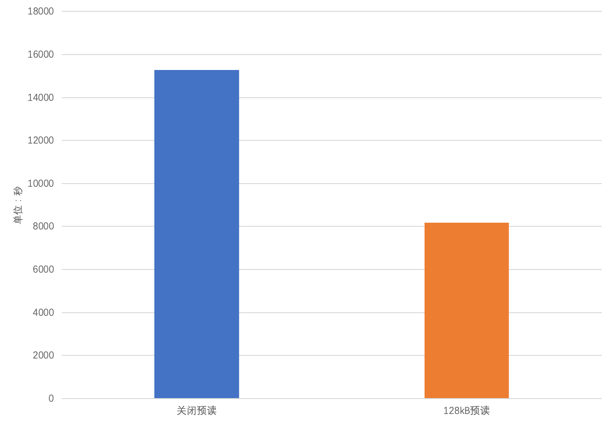
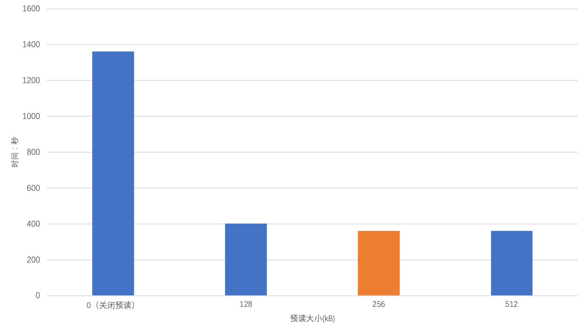
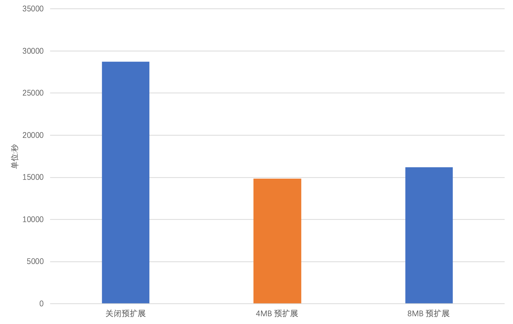

## 开源PolarDB|PostgreSQL 应用开发者&DBA 公开课 - 5.6 PolarDB开源版本必学特性 - PolarDB 特性解读与体验       
                                  
### 作者                                  
digoal                                  
                                  
### 日期                                  
2024-01-25                                  
                                  
### 标签                                  
PostgreSQL , PolarDB , 应用开发者 , DBA , 公开课                        
                                  
----                                  
                                  
## 背景          
  
## PolarDB 特性解读与体验  
  
1、预读 / 预扩展  
  
1\.1、堆表预读  
  
在 PostgreSQL 读取堆表的过程中，会以 8kB 页为单位通过文件系统读取页面至内存缓冲池（Buffer Pool）中。PFS 对于这种数据量较小的 I/O 操作并不是特别高效。所以，PolarDB 为了适配 PFS 而设计了 堆表批量预读。当读取的页数量大于 1 时，将会触发批量预读，一次 I/O 读取 128kB 数据至 Buffer Pool 中。预读对顺序扫描（Sequential Scan）、Vacuum 两种场景性能可以带来一倍左右的提升，在索引创建场景下可以带来 18% 的性能提升。  
  
1\.2、堆表预扩展  
  
在 PostgreSQL 中，表空间的扩展过程中将会逐个申请并扩展 8kB 的页。即使是 PostgreSQL 支持的批量页扩展，进行一次 N 页扩展的流程中也包含了 N 次 I/O 操作。这种页扩展不符合 PFS 最小页扩展粒度为 4MB 的特性。为此，PolarDB 设计了堆表批量预扩展，在扩展堆表的过程中，一次 I/O 扩展 4MB 页。在写表频繁的场景下（如装载数据），能够带来一倍的性能提升。  
  
1\.3、索引创建预扩展  
  
索引创建预扩展与堆表预扩展的功能类似。索引创建预扩展特别针对 PFS 优化索引创建过程。在索引创建的页扩展过程中，一次 I/O 扩展 4MB 页。这种设计可以在创建索引的过程中带来 30% 的性能提升。  
  
  
>注意  
>当前索引创建预扩展只适配了 B-Tree 索引。其他索引类型暂未支持。  
  
  
  
1\.4、使用堆表预读  
  
堆表预读的参数名为 `polar_bulk_read_size`，功能默认开启，默认大小为 `128kB`。不建议用户自行修改该参数，`128kB` 是贴合 PFS 的最优值，自行调整并不会带来性能的提升。  
  
关闭功能：  
```  
ALTER SYSTEM SET polar_bulk_read_size = 0;  
SELECT pg_reload_conf();  
```  
  
打开功能并设置预读大小为 128kB：  
```  
ALTER SYSTEM SET polar_bulk_read_size = '128kB';  
SELECT pg_reload_conf();  
```  
  
1\.5、使用堆表预扩展  
  
堆表预扩展的参数名为 `polar_bulk_extend_size`，功能默认开启，预扩展的大小默认是 4MB。不建议用户自行修改该参数值，4MB 是贴合 PFS 的最优值。  
  
关闭功能：  
```  
ALTER SYSTEM SET polar_bulk_extend_size = 0;  
SELECT pg_reload_conf();  
```  
  
打开功能并设置预扩展大小为 4MB：  
```  
ALTER SYSTEM SET polar_bulk_extend_size = '4MB';  
SELECT pg_reload_conf();  
```  
  
1\.6、使用索引创建预扩展  
  
索引创建预扩展的参数名为 `polar_index_create_bulk_extend_size`，功能默认开启。索引创建预扩展的大小默认是 4MB。不建议用户自行修改该参数值，4MB 是贴合 PFS 的最优值。  
  
关闭功能：  
```  
ALTER SYSTEM SET polar_index_create_bulk_extend_size = 0;  
SELECT pg_reload_conf();  
```  
  
打开功能，并设置预扩展大小为 4MB：  
```  
ALTER SYSTEM SET polar_index_create_bulk_extend_size = 512;  
SELECT pg_reload_conf();  
```  
  
1\.7、性能表现  
  
为了展示堆表预读、堆表预扩展、索引创建预扩展的性能提升效果，以下是 PolarDB for PostgreSQL 14 的实例上进行的测试。  
- 规格：8 核 32GB 内存  
- 测试场景：400GB pgbench 测试  
  
  
1\.7\.1、堆表预读  
  
400GB 表的 Vacuum 性能：  
  
   
  
400GB 表的 SeqScan 性能：  
  
   
  
  
结论：  
- 堆表预读在 Vacuum 和 SeqScan 场景上，性能提升了 1-2 倍  
- 堆表预读大小在超过默认值 128kB 之后对性能提升没有明显帮助  
  
1\.7\.2、堆表预扩展  
  
400GB 表数据装载性能：  
  
   
  
  
结论：  
- 堆表预扩展在数据装载场景下带来一倍的性能提升  
- 堆表预扩展大小在超过默认值 4MB 后对性能没有明显帮助  
  
  
1\.7\.3、索引创建预扩展  
  
400GB 表创建索引性能：  
  
   
  
结论：  
- 索引创建预扩展在索引创建场景下能够带来 30% 的性能提升  
- 加大索引创建预扩展大小超过默认值 4MB 对性能没有明显帮助  
  
  
2、Shared Server  
  
原生 PostgreSQL 的连接调度方式是每一个进程对应一个连接 (One-Process-Per-Connection)，这种调度方式适合低并发、长连接的业务场景。而在高并发或大量短连接的业务场景中，进程的大量创建、销毁以及上下文切换，会严重影响性能。同时，在业务容器化部署后，每个容器通过连接池向数据库发起连接，业务在高峰期会弹性扩展出很多容器，后端数据库的连接数会瞬间增高，影响数据库稳定性，导致 OOM 频发。  
  
  
  
为了解决上述问题，业界在使用 PostgreSQL 时通常会配置连接池组件，比如部署在数据库侧的后置连接池 [PgBouncer](https://www.pgbouncer.org/)，部署在应用侧的前置连接池 [Druid](https://github.com/alibaba/druid)。但后置连接池无法支持保留用户连接私有信息（如 GUC 参数、Prepared Statement）的相关功能，在面临进程被污染的情况（如加载动态链接库、修改 role 参数）时也无法及时清理。前置连接池不仅无法解决后置连接池的缺陷，还无法根据应用规模扩展而实时调整配置，仍然会面临连接数膨胀的问题。  
  
PolarDB for PostgreSQL 针对上述问题，从数据库内部提供了 Shared Server（后文简称 SS）内置连接池功能，采用共享内存 + Session Context + Dispatcher 转发 + Backend Pool 的架构，实现了用户连接与后端进程的解绑。后端进程具备了 Native、Shared、Dedicated 三种执行模式，并且在运行时可以根据实时负载和进程污染情况进行动态转换。负载调度算法充分吸收 AliSQL 对社区版 MySQL 线程池的缺陷改进，使用 Stall 机制弹性控制 Worker 数量，同时避免用户连接饿死。从根本上解决了高并发或者大量短连接带来的性能、稳定性问题。  
  
  
  
TPC-C 高并发性能对比  
- Shared Server 主要应用于高并发或大量短连接的业务场景，因此这里使用 TPC-C 进行测试。  
  
使用 104c 512GB 的物理机单机部署，测试 TPC-C 1000 仓下，并发数从 300 增大到 5000 时，不同配置下的分数对比。如下图所示：  
- old：不使用任何连接池，使用 PostgreSQL 的原生执行模式（即 Native 模式）  
- ss off：使用 Shared Server 内置连接池，启动前关闭 SS 开关，退化为 Native 模式  
- ss native：使用 Shared Server 内置连接池，启动后关闭 SS 开关，退化为 Native 模式  
- ss didicated：使用 Shared Server 内置连接池，启动后开启 SS 开关，但强制使用 Dedicated 模式  
- ss shared：使用 Shared Server 内置连接池，启动后开启 SS 开关，使用标准的 Shared 模式  
  
  
  
从图中可以看出：  
- 原生 PostgreSQL 场景、Shared Server 关闭的场景、Shared Server 兜底场景中，均无法稳定进行 TPC-C 高并发测试。性能从并发数为 1500 时开始下跌，在并发数为 5000 时已经不能提供服务  
- Shared Server 开启并进入 Shared 模式后，TPC-C 性能不受高并发数影响，始终保持在稳定状态，很好地支持了高并发场景  
  
使用说明  
  
常用参数  
  
Shared Server 的典型配置参数说明如下：  
- `polar_enable_shm_aset`：是否开启全局共享内存，当前默认关闭，重启生效  
- `polar_ss_shared_memory_size`：Shared Server 全局共享内存的使用上限，单位 kB，为 `0` 时表示关闭，默认 1MB。重启生效。  
- `polar_ss_dispatcher_count`：Dispatcher 进程的最大个数，默认为 `2`，最大为 CPU 核心数，建议配置与 CPU 核心数相同。重启生效。  
- `polar_enable_shared_server`：Shared Server 功能是否开启，默认关闭。  
- `polar_ss_backend_max_count`：后端进程的最大数量，默认为 `-5`，表示为 `max_connection` 的 `1/5`；`0 / -1` 表示与 `max_connection` 保持一致。建议设置为 CPU 核心数的 10 倍为佳。  
- `polar_ss_backend_idle_timeout`：后端进程的空闲退出时间，默认 3 分钟  
- `polar_ss_session_wait_timeout`：后端进程被用满时，用户连接等待被服务的最大时间，默认 60 秒  
- `polar_ss_dedicated_dbuser_names`：记录指定数据库/用户使用时进入 Native 模式，默认为空，格式为 `d1/_,_/u1,d2/u2`，表示对使用数据库 `d1` 的任意连接、使用用户 `u1` 的任意连接、使用数据库 `d2` 且用户 `u2` 的任意连接，都会回退到 Native 模式  
  
3、闪回表和闪回日志  
  
闪回表功能依赖闪回日志和快速恢复区功能，需要设置 `polar_enable_flashback_log=on` 和 `polar_enable_fast_recovery_area=on` 参数并重启。其他的参数也需要按照需求来修改，建议一次性修改完成并在业务低峰期重启。打开闪回表功能将会增大内存、磁盘的占用量，并带来一定的性能损失，请谨慎评估后再使用。  
  
目前闪回表功能会恢复目标表的数据到一个新表中，表名为 polar_flashback_目标表 OID。在执行 FLASHBACK TABLE 语法后会有如下 NOTICE 提示：  
```  
polardb=# flashback table test to timestamp now() - interval '1h';  
NOTICE:  Flashback the relation test to new relation polar_flashback_54986, please check the data  
FLASHBACK TABLE  
```  
  
其中的 `polar_flashback_54986` 就是闪回恢复出的临时表，只恢复表数据到目标时刻。目前只支持 普通表 的闪回，不支持以下数据库对象：  
- 索引  
- Toast 表  
- 物化视图  
- 分区表 / 分区子表  
- 系统表  
- 外表  
- 含有 toast 子表的表  
  
使用方法  
```  
FLASHBACK TABLE  
    [ schema. ]table  
    TO TIMESTAMP expr;  
```  
  
准备测试数据。创建表 test，并插入数据：  
```  
CREATE TABLE test(id int);  
INSERT INTO test select * FROM generate_series(1, 10000);  
```  
  
查看已插入的数据：  
```  
polardb=# SELECT count(1) FROM test;  
 count  
-------  
 10000  
(1 row)  
  
polardb=# SELECT sum(id) FROM test;  
   sum  
----------  
 50005000  
(1 row)  
```  
  
等待 10 秒并删除表数据：  
```  
SELECT pg_sleep(10);  
DELETE FROM test;  
```  
  
表中已无数据：  
```  
polardb=# SELECT * FROM test;  
 id  
----  
(0 rows)  
```  
  
闪回表到 10 秒之前的数据：  
```  
polardb=# FLASHBACK TABLE test TO TIMESTAMP now() - interval'10s';  
NOTICE:  Flashback the relation test to new relation polar_flashback_65566, please check the data  
FLASHBACK TABLE  
```  
  
检查闪回表数据：  
```  
polardb=# SELECT count(1) FROM polar_flashback_65566;  
 count  
-------  
 10000  
(1 row)  
  
polardb=# SELECT sum(id) FROM polar_flashback_65566;  
   sum  
----------  
 50005000  
(1 row)  
```  
  
更多用法和注意事项请参考[PolarDB 开源官方手册](https://apsaradb.github.io/PolarDB-for-PostgreSQL/zh/features/v11/availability/flashback-table.html)  
  
4、弹性跨机并行查询（ePQ）  
  
PostgreSQL 提供了 `EXPLAIN` 命令用于 SQL 语句的性能分析。它能够输出 SQL 对应的查询计划，以及在执行过程中的具体耗时、资源消耗等信息，可用于排查 SQL 的性能瓶颈。  
  
`EXPLAIN` 命令原先只适用于单机执行的 SQL 性能分析。PolarDB-PG 的 ePQ 弹性跨机并行查询扩展了 EXPLAIN 的功能，使其可以打印 ePQ 的跨机并行执行计划，还能够统计 ePQ 执行计划在各个算子上的执行时间、数据扫描量、内存使用量等信息，并以统一的视角返回给客户端。  
  
ePQ执行计划查看  
  
ePQ 的执行计划是分片的。每个计划分片（Slice）由计算节点上的虚拟执行单元（Segment）启动的一组进程（Gang）负责执行，完成 SQL 的一部分计算。ePQ 在执行计划中引入了 Motion 算子，用于在执行不同计划分片的进程组之间进行数据传递。因此，Motion 算子就是计划分片的边界。  
  
ePQ 中总共引入了三种 Motion 算子：  
- `PX Coordinator`：源端数据发送到同一个目标端（汇聚）  
- `PX Broadcast`：源端数据发送到每一个目标端（广播）  
- `PX Hash`：源端数据经过哈希计算后发送到某一个目标端（重分布）  
  
以一个简单查询作为例子：  
```  
=> CREATE TABLE t (id INT);  
=> SET polar_enable_px TO ON;  
=> EXPLAIN (COSTS OFF) SELECT * FROM t LIMIT 1;  
                   QUERY PLAN  
-------------------------------------------------  
 Limit  
   ->  PX Coordinator 6:1  (slice1; segments: 6)  
         ->  Partial Seq Scan on t  
 Optimizer: PolarDB PX Optimizer  
(4 rows)  
```  
  
以上执行计划以 `Motion` 算子为界，被分为了两个分片：一个是接收最终结果的分片 `slice0`，一个是扫描数据的分片`slice1`。对于 `slice1` 这个计划分片，ePQ 将使用六个执行单元（`segments: 6`）分别启动一个进程来执行，这六个进程各自负责扫描表的一部分数据（`Partial Seq Scan`），通过 `Motion` 算子将六个进程的数据汇聚到一个目标端（`PX Coordinator 6:1`），传递给 `Limit` 算子。  
  
如果查询逐渐复杂，则执行计划中的计划分片和 `Motion` 算子会越来越多：  
```  
=> CREATE TABLE t1 (a INT, b INT, c INT);  
=> SET polar_enable_px TO ON;  
=> EXPLAIN (COSTS OFF) SELECT SUM(b) FROM t1 GROUP BY a LIMIT 1;  
                         QUERY PLAN  
------------------------------------------------------------  
 Limit  
   ->  PX Coordinator 6:1  (slice1; segments: 6)  
         ->  GroupAggregate  
               Group Key: a  
               ->  Sort  
                     Sort Key: a  
                     ->  PX Hash 6:6  (slice2; segments: 6)  
                           Hash Key: a  
                           ->  Partial Seq Scan on t1  
 Optimizer: PolarDB PX Optimizer  
(10 rows)  
```  
  
以上执行计划中总共有三个计划分片。将会有六个进程（`segments: 6`）负责执行 `slice2` 分片，分别扫描表的一部分数据，然后通过 `Motion` 算子（`PX Hash 6:6`）将数据重分布到另外六个（`segments: 6`）负责执行 `slice1` 分片的进程上，各自完成排序（`Sort`）和聚合（`GroupAggregate`），最终通过 `Motion` 算子（`PX Coordinator 6:1`）将数据汇聚到结果分片 `slice0`。  
  
更多弹性跨机并行查询（ePQ）用法和注意事项请参考[PolarDB 开源官方手册](https://apsaradb.github.io/PolarDB-for-PostgreSQL/zh/features/v11/epq/)  
  
更多特性参考[PolarDB 开源官方手册](https://apsaradb.github.io/PolarDB-for-PostgreSQL/zh/)  
       
  
  
#### [期望 PostgreSQL|开源PolarDB 增加什么功能?](https://github.com/digoal/blog/issues/76 "269ac3d1c492e938c0191101c7238216")
  
  
#### [PolarDB 开源数据库](https://openpolardb.com/home "57258f76c37864c6e6d23383d05714ea")
  
  
#### [PolarDB 学习图谱](https://www.aliyun.com/database/openpolardb/activity "8642f60e04ed0c814bf9cb9677976bd4")
  
  
#### [购买PolarDB云服务折扣活动进行中, 55元起](https://www.aliyun.com/activity/new/polardb-yunparter?userCode=bsb3t4al "e0495c413bedacabb75ff1e880be465a")
  
  
#### [PostgreSQL 解决方案集合](../201706/20170601_02.md "40cff096e9ed7122c512b35d8561d9c8")
  
  
#### [德哥 / digoal's Github - 公益是一辈子的事.](https://github.com/digoal/blog/blob/master/README.md "22709685feb7cab07d30f30387f0a9ae")
  
  
#### [About 德哥](https://github.com/digoal/blog/blob/master/me/readme.md "a37735981e7704886ffd590565582dd0")
  
  

  
