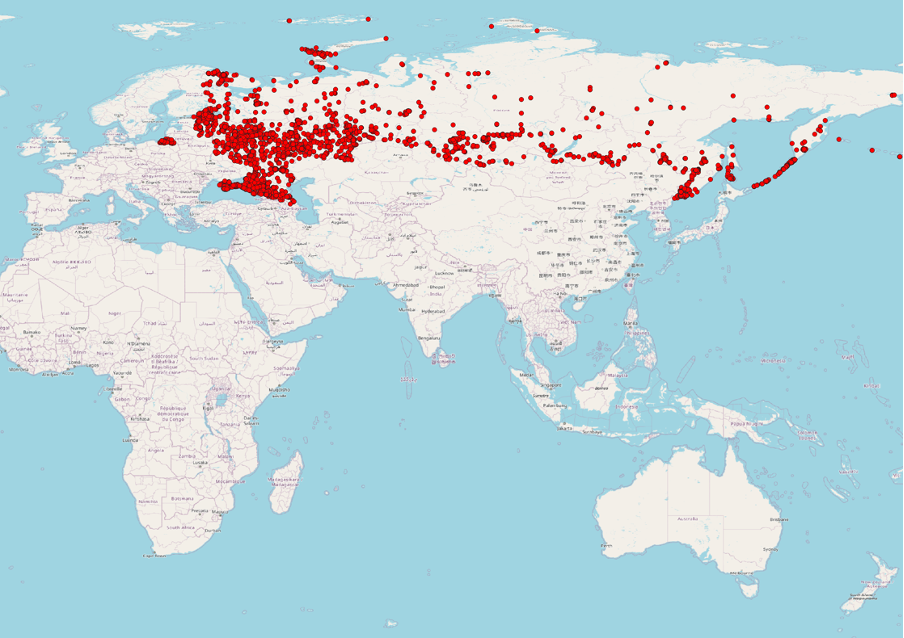
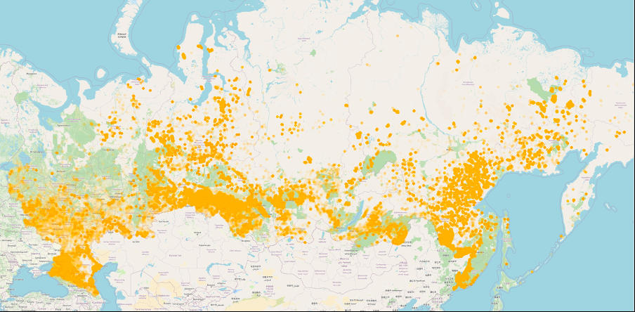
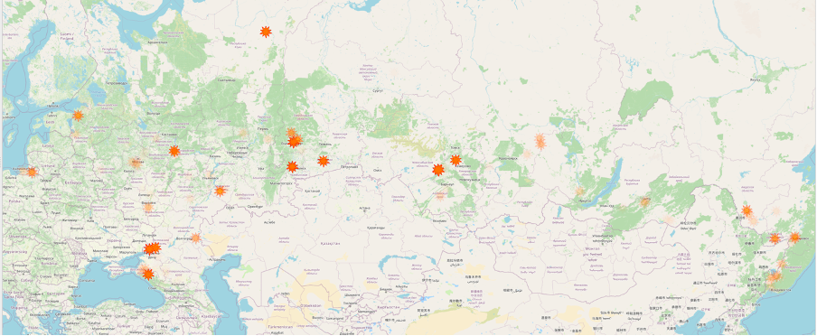
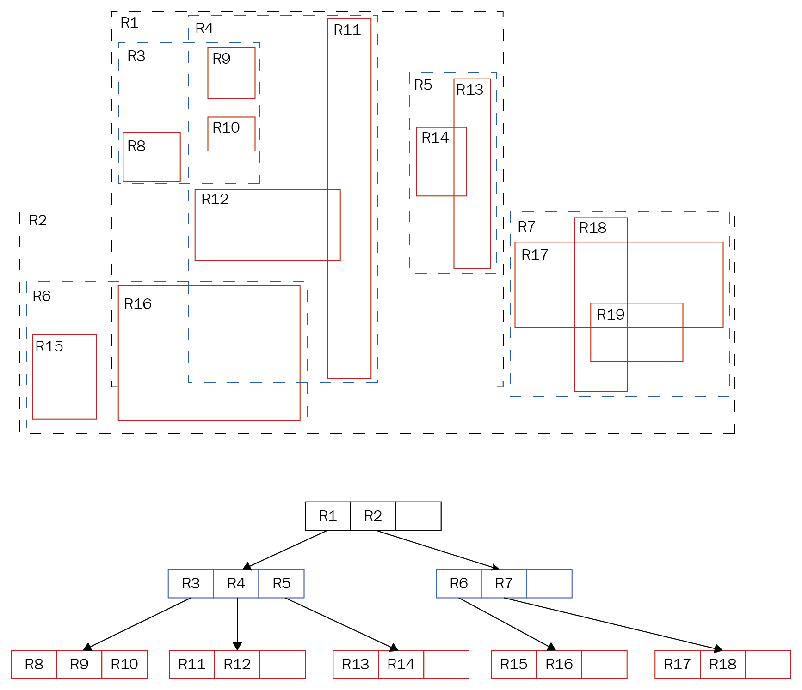
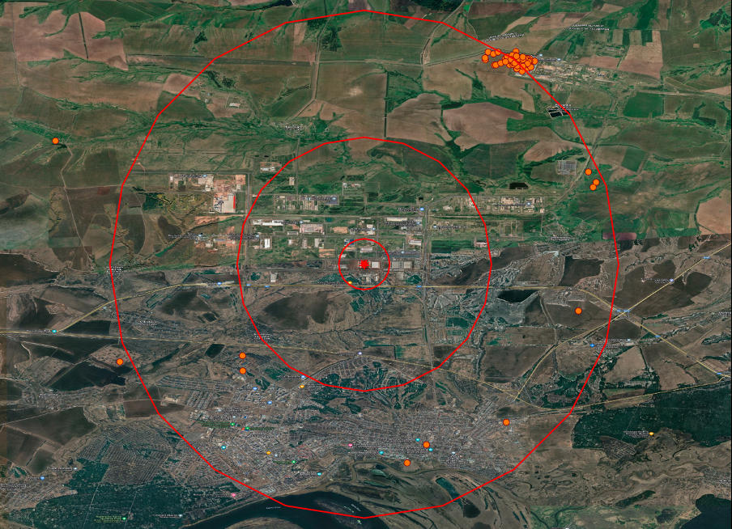
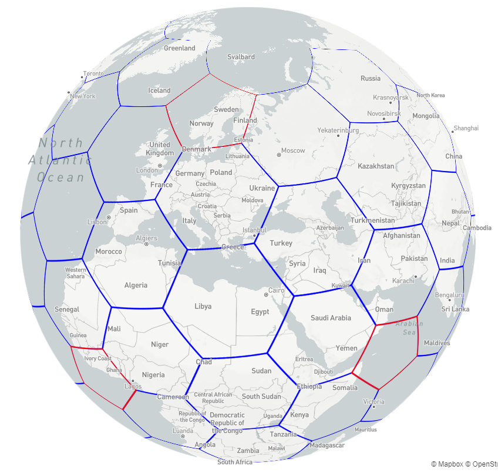
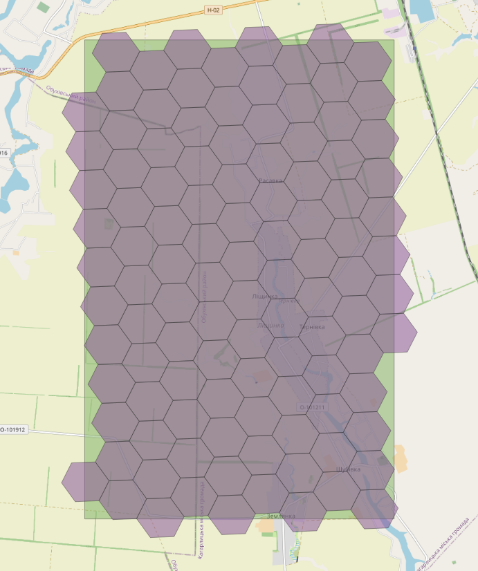
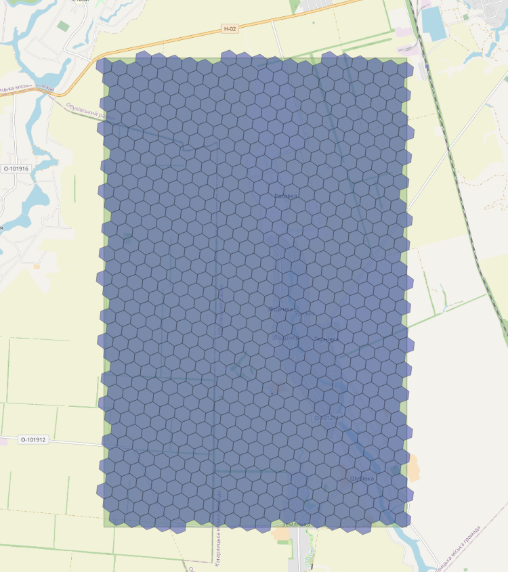

## 翻译: 如何使用 PostgreSQL 执行（军事）地理分析任务    
                                                                                    
### 作者                                                                                    
Taras Kloba                                                                                    
                                                                                    
### 日期                                                                                    
2024-03-14                                                                             
                                                                                    
### 标签                                                                                    
PostgreSQL , PolarDB , DuckDB , 地理信息分析                       
                                                                                    
----                                                                                    
                                                                                    
## 背景    
原文地址: https://klioba.com/how-to-use-postgresql-for-military-geoanalytics-tasks  
  
# 翻译内容如下  
地理分析在军事事务中至关重要，因为军事数据的很大一部分包含地理属性。在本文中，我将讨论如何使用 PostgreSQL 处理地理空间数据并解决常见的地理分析任务。这些信息将涵盖查找最近物体、距离计算以及使用地理空间索引来增强这些过程的方法。我们还将探索确定多边形内的点和地理空间聚合的技术。本文的目标是提供实际示例和技巧，以增强地理空间数据的使用并有助于新解决方案的开发。  
  
*文章中使用的材料和数据都是开源的，并得到了军方代表的认可。*  
  
## 第一个数据源：如何将俄罗斯军事多边形数据导入PostgreSQL  
我将需要某些数据集来启动分析并展示 PostgreSQL 在地理分析方面的功能。我决定从[OpenStreetMap (OSM)](https://www.openstreetmap.org/)上提供的俄罗斯军事设施数据开始 。第一步是将这些数据加载到 PostgreSQL 中，之后我们可以使用工具来优化查询并提高其效率。  
  
要从 OSM 导入俄罗斯军事目标的数据，我们将使用 [osm2pgsql](https://osm2pgsql.org/) 工具。这个开源工具可以有效地将数据从 OSM 传输到 PostgreSQL。我们将加载 [Russia-latest.osm.pbf](http://download.geofabrik.de/russia-latest.osm.pbf) 文件 (3.4 GB)，其中包含有关 OSM 中的点、线、道路和多边形的信息。加载后，该文件将用于填充PostgreSQL中相应的表，我们可以在其中开始数据的分析和处理。  
  
我们使用的脚本包括加载 OSM 数据、创建新的 PostgreSQL 数据库以及使用 osm2pgsql 导入数据的命令：  
```  
#!/bin/bash  
   
# Variable for the database and OSM file name  
DB_NAME="russia_latest"    
   
# Construct the OSM data URL using the DB_NAME  
OSM_DATA_URL="http://download.geofabrik.de/russia-latest.osm.pbf"  
   
# Download the latest OSM data for Russia  
echo "Downloading OSM data for Russia..."  
wget $OSM_DATA_URL -O $DB_NAME.osm.pbf  
   
# Create a new PostgreSQL database with the corrected name  
echo "Creating new PostgreSQL database named $DB_NAME..."  
sudo -u postgres psql -c "CREATE DATABASE $DB_NAME;"  
sudo -u postgres psql -d $DB_NAME -c "CREATE EXTENSION postgis;"  
   
# Import the OSM data into the PostgreSQL database using osm2pgsql  
echo "Importing OSM data into PostgreSQL database named $DB_NAME..."  
osm2pgsql --create \  
          --verbose \  
          --database $DB_NAME \  
          --latlong \  
          --number-processes 4 \  
          --username postgres \  
          --host localhost \  
          --port 5432 \  
          --password \  
          $DB_NAME.osm.pbf  
   
echo "Data import complete."   
```  
  
[view rawimport_russia_osm_to_postgres.sh hosted with ❤ by GitHub](https://gist.github.com/kloba/5df9d0e76adabeda278c6d5c9cef7828/raw/53f81e7e330df6dae040d5584e05240de5a0e280/import_russia_osm_to_postgres.sh)   
  
  
执行脚本后，我们的数据库中将出现五个主要表：  
- osm2pgsql_properties —存储数据导入期间使用的设置和属性。  
- Planet_osm_line —包含线性元素，例如道路和河流。  
- Planet_osm_point —包括点对象，例如建筑物（并非所有建筑物都被标记为地理多边形，因此我们必须设计一些东西来处理这些点）。  
- Planet_osm_polygon —存储代表区域的多边形，例如军事基地。  
- Planet_osm_roads —存储交通路线。  
  
为了简化军事对象的分析，我们将创建一个名为Military_geometries的表。SQL 脚本将从 planet_osm_line、planet_osm_point、planet_osm_polygon和 planet_osm_roads表中选择数据，过滤掉军事对象。使用 [ST_Buffer](https://postgis.net/docs/ST_Buffer.html) 将 100 米缓冲区应用于线、点和道路 。这还允许我们基于点和线创建多边形，提供分析的能力，例如，一个点是否在指定的多边形内。  
```  
DROP TABLE IF EXISTS military_geometries;  
   
CREATE TABLE military_geometries AS  
SELECT osm_id, 'line' AS geom_type, landuse, military, building, name, operator,  
       ST_Buffer(way, 0.0009)::geometry(Polygon, 4326) AS geom  
FROM public.planet_osm_line  
WHERE military IS NOT NULL OR building = 'military' OR landuse = 'military'  
   
UNION ALL  
   
SELECT osm_id, 'point' AS geom_type, landuse, military, building, name, operator,  
       ST_Buffer(way, 0.0009)::geometry(Polygon, 4326) AS geom  
FROM public.planet_osm_point  
WHERE military IS NOT NULL OR building = 'military' OR landuse = 'military'  
   
UNION ALL  
   
SELECT osm_id, 'polygon' AS geom_type, landuse, military, building, name, operator,  
       way::geometry(Polygon, 4326) AS geom  
FROM public.planet_osm_polygon  
WHERE military IS NOT NULL OR building = 'military' OR landuse = 'military'  
   
UNION ALL  
   
SELECT osm_id, 'road' AS geom_type, landuse, military, building, name, operator,  
       ST_Buffer(way, 0.0009)::geometry(Polygon, 4326) AS geom  
FROM public.planet_osm_roads  
WHERE military IS NOT NULL OR building = 'military' OR landuse = 'military';  
   
--  
SELECT 9252 Query returned successfully in 12 secs 151 ms.   
```  
  
[view rawcreate_military_geometries.sql hosted with ❤ by GitHub](https://gist.github.com/kloba/882a40179ba66d7d218ab8ef9a306fd7/raw/30f147a5890b32a7243220d3aa3f53e4c8a53162/create_military_geometries.sql)  
  
执行提供的 SQL 脚本将允许我们创建一个 Military_geometries表，其中包含 OSM 上识别的 9,252 个军事物体的多边形：  
  
  
  
使用 QGIS 对俄罗斯和临时占领的克里米亚自治共和国的 9,252 个军事地点进行可视化  
  
在 OSM 中，与其他开源一样，信息可能会发生变化。例如，从2022年初开始，俄罗斯删除了2995个军事目标。  
  
他们说，“屏幕截图不会被烧毁”，但这种删除往往会导致[史翠珊效应](https://en.wikipedia.org/wiki/Streisand_effect)，即试图隐藏信息只会吸引更多关注。如果您想深入研究 OSM 的历史数据并帮助识别此类异常情况，您可以使用 [GeoFabrik.de](https://download.geofabrik.de/russia.html) 等资源。虽然这与我们的分析没有直接关系，但我想展示这些被删除的物体在地图上的样子，说明俄罗斯试图隐藏重要数据。  
  
  
  
2022 年 1 月 1 日之后删除（蓝色）和莫斯科军事设施现有（红色）地理多边形  
  
## 第二个数据源：NASA卫星的火灾数据  
作为下一个数据源，我们将利用马里兰大学在 NASA 和联合国的支持下于 2007 年开发的[火灾信息资源管理系统](https://www.earthdata.nasa.gov/learn/find-data/near-real-time/firms/vj114imgtdlnrt)  (FIRMS) 的信息。FIRMS 可以利用数据实时监控全球正在发生的火灾来自 S-NPP 和 NOAA 20 卫星上配备 MODIS 光谱辐射计和 VIIRS 的 Aqua 和 Terra 卫星。该信息每三个小时更新一次，美国和加拿大的更新频率更高。  
  
自 2022 年以来，我们将使用 FIRMS 数据来识别俄罗斯军事设施境内的火灾。  
  
为了从 FIRMS 系统下载火灾数据，我们将使用以下脚本，提取从 2022 年 1 月 1 日到当前日期俄罗斯的所有火灾记录。然后，这些数据将被导入到PostgreSQL 数据库中的新表viirs_fire_events中。  
```  
from datetime import datetime, timedelta  
import time  
import requests  
import psycopg2  
import csv  
from psycopg2.extras import execute_values  
   
# Your NASA FIRMS API key  
api_key = 'your_api_key'  
   
# Start and end dates for the data retrieval  
start_date = datetime(2022, 1, 1)  
end_date = datetime(2023, 12, 24)  
   
# URL for the NASA FIRMS API call  
base_url = "https://firms.modaps.eosdis.nasa.gov/api/country/csv/{}/VIIRS_NOAA20_NRT/RUS/1/{}"  
   
# Database connection details  
db_name = 'your_db_name'  
db_user = 'your_db_user'  
db_password = 'your_db_password'  
db_host = 'your_db_host'  
db_port = 'your_db_port'  
   
# Function to insert data into PostgreSQL  
def insert_data_into_db(data, cursor):  
    insert_query = """INSERT INTO viirs_fire_events (country_id, latitude, longitude, bright_ti4, scan, track, acq_date, acq_time, satellite, instrument, confidence, version, bright_ti5, frp, daynight) VALUES %s;"""  
    execute_values(cursor, insert_query, data)  
   
# Function to fetch and insert data into the database  
def fetch_and_insert_data(date, cursor):  
    formatted_date = date.strftime("%Y-%m-%d")  
    try:  
        response = requests.get(base_url.format(api_key, formatted_date))  
          
        if "Invalid MAP_KEY" in response.text:  
            print(f"Invalid MAP_KEY detected for {formatted_date}. Waiting for 10 minutes before retrying.")  
            time.sleep(600)  # Wait for 10 minutes  
            return fetch_and_insert_data(date, cursor)  # Retry  
   
        decoded_content = response.content.decode('utf-8')  
        csv_reader = csv.reader(decoded_content.splitlines(), delimiter=',')  
        next(csv_reader, None)  # Skip the header  
        rows = [tuple(row) for row in csv_reader if row]  
   
        if rows:  
            insert_data_into_db(rows, cursor)  
            print(f"Data for {formatted_date} inserted successfully (rows = {len(rows)}).")  
        else:  
            print(f"No valid data to insert for {formatted_date}.")  
   
    except Exception as e:  
        # General exception handler for any other unexpected errors  
        print(f"Error fetching data for {formatted_date}: {e}")  
   
try:  
    conn = psycopg2.connect(dbname=db_name, user=db_user, password=db_password, host=db_host, port=db_port)  
    cur = conn.cursor()  
   
    current_date = start_date  
    while current_date <= end_date:  
        fetch_and_insert_data(current_date, cur)  
        conn.commit()  
        current_date += timedelta(days=1)  
      
except Exception as e:  
    print(f"Database error: {e}")  
finally:  
    if cur is not None:  
        cur.close()  
    if conn is not None:  
        conn.close()  
   
print("Data fetching and insertion complete.")   
```  
  
[view rawfetch_insert_viirs_fire_data.py hosted with ❤ by GitHub](https://gist.github.com/kloba/8c64099f4286fd3275b7a9604e5b9128/raw/39f00d492399472677477433cb64205f610300ae/fetch_insert_viirs_fire_data.py)  
  
因此，我们将填充viirs_fire_events表，其中将包含 1,711,475 条俄罗斯火灾记录。这些火灾的表现如下：  
  
  
  
自 2022 年 1 月 1 日以来俄罗斯火灾可视化（1,711,475 起火灾）  
  
PostgreSQL 数据库中的viirs_fire_events表将用于存储详细的火灾数据，其中包含坐标、卫星参数、采集日期和时间以及其他关键元数据字段。将根据经度和 纬度列中的数据自动填充数据类型为GEOMETRY(POINT, 4326)的新列。  
```  
CREATE TABLE viirs_fire_events (  
    country_id TEXT,  
    latitude FLOAT,  
    longitude FLOAT,  
    bright_ti4 FLOAT,  
    scan FLOAT,  
    track FLOAT,  
    acq_date DATE,  
    acq_time INT,  
    satellite TEXT,  
    instrument TEXT,  
    confidence TEXT,  
    version TEXT,  
    bright_ti5 FLOAT,  
    frp FLOAT,  
    daynight TEXT,  
    geom GEOMETRY(POINT, 4326) GENERATED ALWAYS AS (ST_MakePoint(longitude, latitude)) STORED  
);   
```  
  
[view rawcreate_viirs_fire_events_table.sql hosted with ❤ by GitHub](https://gist.github.com/kloba/14a295808b1173044ef2ace4465fb5f4/raw/d7cfec4dc63a6b25ddf8f160758c20b430da0a5c/create_viirs_fire_events_table.sql)  
  
假设您有兴趣使用有关军事物体和火灾的数据，但所描述的提取数据集的过程似乎非常耗时。在这种情况下，可以为您导出 CSV 表。您可以通过以下链接下载它们： [military_geometries](https://storage.googleapis.com/files.sql.ua/csv/military_geometries.csv)、 [viirs_fire_events](https://storage.googleapis.com/files.sql.ua/csv/viirs_fire_events.csv)。  
  
## 搜索发生火灾的军事设施：多边形内的点  
目前，我们有两个表：Military_geometries和 viirs_fire_events。让我们尝试查找那些发生过火灾（自 2022 年初以来）或尚未发生火灾的军事设施 🙂。  
  
  
  
让我们使用带有 [ST_Contains](https://postgis.net/docs/ST_Contains.html) 函数的 SQL 查询来识别从 NASA 卫星检测到火灾的军事物体。  
```  
SELECT mg.osm_id,   
    mg.geom_type,   
    mg.landuse,   
    mg.military,   
    mg.building,   
    mg.name,   
    mg.operator,   
    mg.geom  
FROM public.military_geometries AS mg  
WHERE EXISTS (  
    SELECT 1  
    FROM public.viirs_fire_events AS vfe  
    WHERE ST_Contains(mg.geom, vfe.geom)  
);  
--  
Successfully run. Total query runtime: 54 min 15 secs. 129 rows affected.   
```  
  
[view rawselect_military_areas_with_fires.sql hosted with ❤ by GitHub](https://gist.github.com/kloba/49609e30b2b736c4d758c26c11fea068/raw/a75ff87ee03a31ad47b645b90195b98884b90464/select_military_areas_with_fires.sql)  
  
您可能已经注意到，我们已经确定了自 2022 年初以来发生过火灾的 129 个军事场所。有趣的是，在某些情况下，这些火灾似乎发生了不止一次。  
  
  
  
2022年初以来发生火灾的军事设施（设施的透明度表明火灾事件的频率）  
  
您可能注意到的第二个方面是，指定的查询执行了 54 分 15 秒，这对于如此简单的操作来说相当长。使用 [EXPLAIN ANALYZE](https://www.postgresql.org/docs/current/sql-explain.html) 命令来了解此持续时间的原因很有帮助。该命令允许您分析查询执行过程，识别潜在的瓶颈，并进一步优化查询以提高性能。  
```  
Nested Loop Semi Join  (cost=0.00..395827843592.52 rows=8 width=524) (actual time=4628.471..4005790.130rows=129 loops=1)  
  Join Filter: st_contains(mg.geom, vfe.geom)  
  Rows Removed by Join Filter: 15695214562  
  ->  Seq Scan on military_geometries mg  (cost=0.00..649.52 rows=9252 width=524) (actual time=0.009..22.516rows=9252 loops=1)  
  ->  Materialize  (cost=0.00..70285.12 rows=1711475 width=32) (actual time=0.015..121.310 rows=1696413loops=9252)  
        ->  Seq Scan on viirs_fire_events vfe  (cost=0.00..50027.75 rows=1711475 width=32) (actual time=124.339..351.922 rows=1711475 loops=1)  
Planning Time: 0.923 ms  
Execution Time: 4005798.854 ms   
```  
  
[view rawmilitary_areas_with_fires_query_plan.txt hosted with ❤ by GitHub](https://gist.github.com/kloba/5865856dae4e0995bcf00967394d2d50/raw/4234182603ecc1d21225948c7e6f7e965a267c21/military_areas_with_fires_query_plan.txt)  
  
在本例中，当使用Nested Loop Semi Join运算符时，我们遇到了 `O(n*m)` 的复杂度，其中 n 是 Military_geometries 表中的 9,252 行 ， m 是 viirs_fire_events中的 1,711,475 行。这意味着第一个表中的每一行都会与第二个表中的每一行进行比较，从而导致大量操作。  
  
因此，让我们讨论如何通过利用索引来加快此类查询的执行速度。  
  
## 生产力提升：在地理分析中利用索引  
PostgreSQL 以其可扩展性功能而闻名，提供了多种访问该数据库中的地理空间数据的方法。要查找适合处理二维空间中的点的所有方法，我们可以执行以下查询：  
```  
SELECT am.amname AS access_method, typ.typname, opc.opcname AS operator_class   
FROM pg_am am  
INNER JOIN pg_opclass opc ON am.oid = opc.opcmethod  
INNER JOIN pg_type typ ON typ.oid = opc.opcintype  
WHERE (opc.opcname LIKE '%geometry%' OR opc.opcname LIKE '%point%')  
AND (  
    opc.opcname NOT LIKE '%3d%' AND  
    opc.opcname NOT LIKE '%4d%' AND  
    opc.opcname NOT LIKE '%nd%'  
);   
```  
  
[view rawselect_geometry_operator_classes.sql hosted with ❤ by GitHub](https://gist.github.com/kloba/fc87c4192c371f543a811691c6ea921c/raw/9b5f2795da225de9c4c490009379a49e0411ad28/select_geometry_operator_classes.sql)  
  
因此，我们将观察到至少五种访问方法，包括 btree、hash、gist、brin 和 spgist。我建议通过为每个方法和运算符类创建索引来进行调查。创建索引后，我们将评估有关俄罗斯军事设施火灾的查询性能，以确定哪些方法对我们的任务最有效。  
  
索引类型	|索引运算符ops	|过滤运算符	|索引创建时间	|索引大小	|查询执行时间	|简要说明  
---|---|---|---|---|---|---  
btree	|btree_geometry_ops	|没有相应的运算符 - 此查询将忽略索引。	|1 秒 918 毫秒	|81MB	|53 分 45 秒（129 行受影响）	|支持相等和范围查询；快速且有组织地检索数据。  
hash	|hash_geometry_ops|	没有相应的运算符 - 此查询将忽略索引。	|3 秒 158 毫秒	|59MB	|53 分 15 秒（129 行受影响）	|快速等式搜索；不适合排序或范围查询。  
brin	|brin_geometry_inclusion_ops_2d|	@（geometry, geometry）	|536 毫秒	|0.032MB	|28 分 3 秒（129 行受影响）	|对于具有自然排序数据的大型数据集有效；索引块范围而不是单个行。  
gist	| gist_geometry_ops_2d	|@(geometry,geometry)	|11 秒 659 毫秒	|94MB	|493 毫秒（129 行受影响）	|支持广泛的查询，包括重叠和邻近的空间搜索。  
spgist	|spgist_geometry_ops_2d	|@(geometry,geometry)	|6 秒 290 毫秒	|78MB	|353 毫秒（129 行受影响）	|适用于分布不均匀的数据；支持多种分裂树结构。  
gist	|point_ops	|`<@(point,polygon)`	|1 秒 426 毫秒	|81MB	|306毫秒（返回132条记录）	|非常适合点数据；支持空间关系查询，例如包含、交集等。  
spgist	|quad_point_ops	|`<@(point,box)`|	4 秒 849 毫秒	|77MB	|243 毫秒（173 行受影响）	|利用四叉树来索引点数据；在空间分析的特定场景中有效。  
spgist	|kd_point_ops	|`<@(point,box)`|	5 秒 204 毫秒	|93MB	|199 毫秒（173 行受影响）	|采用 kd 树来处理多维点数据；非常适合寻找最近的邻居。  
  
注意：所提到的运算符类不使用几何数据类型进行搜索；它们使用 `<@(point,polygon)` 和 `<@(point,box)` 。因此，行计数可能与输出不匹配（例如，复杂的地理多边形可能已简化为矩形）。  
  
结果表显示，对我们的任务最有效的索引是 [GiST](https://www.postgresql.org/docs/current/gist.html) 和 [SP-GiST](https://www.postgresql.org/docs/current/spgist.html) 。让我们深入研究一下它们是如何运作的。    
  
## GiST 的工作原理  
PostgreSQL 中的广义搜索树 (GiST) 索引使用平衡树的概念，可以跨不同数据类型进行高效排序和搜索。它们提供了开发用于索引的自定义运算符的能力，使得 GiST 非常通用并且能够适应特定的要求。  
  
  
  
*PostgreSQL中GiST索引的层次结构[1]*  
  
在所描述的 GiST 树的示例中：在顶层，有 R1和R2，用作其他元素的边界框。R1 包含R3、R4和R5，而R3又包含 R8、R9和R10。GiST 索引具有分层结构，可以显着加快搜索速度。与 B 树不同，GiST 支持重叠操作和空间关系确定。这就是 GiST 非常适合索引几何数据的原因。  
  
## SP-GiST 的工作原理  
PostgreSQL 中的空间分区广义搜索树 (SP-GiST) 索引专为将空间分区为非重叠区域的数据结构而设计，例如象限树或前缀树。它们能够将数据递归划分为子集，形成不平衡的树。这使得 SP-GiST 索引对于内存使用特别有效，由于每个节点中的级别较少且数据组较小，因此它们可以快速处理查询。  
  
然而，SP-GiST 索引在存储在磁盘上时存在缺点，因为其运行需要大量磁盘操作，尤其是在大型数据库中。  
  
考虑到这一点，GiST 索引通常成为更好的选择，尤其是在处理多边形和复杂空间结构时。  
  
## 寻找最近的邻居：Shahed 生产厂附近发生了 10 起火灾  
现在，让我们尝试使用 PostgreSQL 来解决查找最近邻居的任务。使用我们的数据集，我们将尝试识别在俄罗斯制造伊朗 Shahed 无人机的工厂附近发生的十起火灾。有关该植物的更多详细信息，您可以参考 Molfar 团队进行的[研究](https://molfar.com/blog/alabuga-deanon)。该工厂位于鞑靼斯坦共和国[阿拉布加](https://en.wikipedia.org/wiki/Alabuga_Special_Economic_Zone)经济特区 ，这里以前生产猫粮和汽车玻璃，还种植蘑菇。然而，在对俄罗斯实施制裁之后，其优先事项发生了转变，现在它在俄罗斯的无人机生产计划中发挥着关键作用。  
  
解决此任务的方法之一是以围绕所选目标的圆圈形式创建缓冲区。该缓冲区被递归扩展，直到获得所需数量的结果。在 PostgreSQL 中，这可以通过以下 SQL 查询来实现，该查询形成缓冲区并识别在选定对象的指定半径内发生的火灾：  
```  
SELECT *  
FROM public.viirs_fire_events  
WHERE ST_DWithin(  
    geom,   
    ST_SetSRID(ST_MakePoint(52.048470, 55.821688), 4326)::geography,   
    10000 -- can be changed to 1000, 5000, 10000, ...  
)  
LIMIT 10;  
   
--  
Successfully run. Total query runtime: 1 secs 157 ms.  
10 rows affected.   
```  
  
[view rawselect_viirs_events_near_point.sql hosted with ❤ by GitHub](https://gist.github.com/kloba/44b4f72ebbf45f8e3babd82ef2f04e14/raw/cfe3a744c094d1bf4d490bb82c1dfdcee135f40a/select_viirs_events_near_point.sql)  
  
这种方法涉及逐渐扩大缓冲区并分析结果，这可能非常耗时。  
  
  
  
*鞑靼斯坦的一家工厂生产的 Shaheds 具有 1.5 公里和 10 公里半径内的火焰可视化功能*  
  
GiST 索引支持的各种运算符可用于优化地理空间查询。要检索与 GiST 索引一起使用的可用运算符列表，您可以执行 SQL 查询来扫描 PostgreSQL 系统表并提供有关与 gist_geometry_ops_2d 运算符类关联的运算符的信息。这将有助于确定在数据库中执行特定地理空间操作的最有效的操作员。  
```  
SELECT  
    amopopr::regoperator,   
    oprcode::regproc,   
    obj_description(opr.oid, 'pg_operator') description  
FROM pg_am am  
INNER JOIN pg_opclass opc ON opcmethod = am.oid  
INNER JOIN pg_amop amop ON amopfamily = opcfamily  
INNER JOIN pg_operator opr ON opr.oid = amopopr  
WHERE amname = 'gist'  
    AND opcname = 'gist_geometry_ops_2d'  
ORDER BY amopstrategy;  
   
--  
 amopopr                |    oprcode            | description  
------------------------+-----------------------+-----------------------------------  
 <<(geometry,geometry)  | geometry_left         | Determines if one geometry is left of another  
 &<(geometry,geometry)  | geometry_overleft     | Checks if one geometry overlaps the left of another  
 &&(geometry,geometry)  | geometry_overlaps     | Checks if two geometries overlap  
 &>(geometry,geometry)  | geometry_overright    | Determines if one geometry overlaps the right of another  
 >>(geometry,geometry)  | geometry_right        | Determines if one geometry is right of another  
 ~=(geometry,geometry)  | geometry_same         | Checks if two geometries are the same  
 ~(geometry,geometry)   | geometry_contains     | Determines if one geometry contains another  
 @(geometry,geometry)   | geometry_within       | Determines if one geometry is within another  
 &<|(geometry,geometry) | geometry_overbelow    | Determines if one geometry overlaps below another  
 <<|(geometry,geometry) | geometry_below        | Determines if one geometry is below another  
 |>>(geometry,geometry) | geometry_above        | Determines if one geometry is above another  
 |&>(geometry,geometry) | geometry_overabove    | Determines if one geometry overlaps above another  
 <->(geometry,geometry) | geometry_distance_centroid | Calculates centroid distance between geometries  
 <#>(geometry,geometry) | geometry_distance_box | Calculates box distance between geometries   
```  
  
[view rawselect_gist_geometry_operators.sql hosted with ❤ by GitHub](https://gist.github.com/kloba/99d7f600c728f184d412d77ce8028fb4/raw/0d0d978943a027275e567f0ce6961f3fb9899965/select_gist_geometry_operators.sql)  
  
我们的 GiST 索引提供了处理地理数据的广泛功能，使您可以确定对象的空间位置并测量距离。`<->` 运算符允许按与指定点的接近程度对对象进行排序。在此示例中，我们使用此运算符来识别距离指定位置最近的十处火灾。  
```  
SELECT *  
FROM public.viirs_fire_events  
ORDER BY geom <-> ST_SetSRID(ST_MakePoint(52.048470, 55.821688), 4326)  
LIMIT 10;  
   
--  
Successfully run. Total query runtime: 78 ms.  
10 rows affected.   
```  
  
[view rawselect_nearest_viirs_events.sql hosted with ❤ by GitHub](https://gist.github.com/kloba/b3ac9dab240ca834cf20b61016f0da3e/raw/845379a0e50c5aafbe95f034d30a55ce614c6449/select_nearest_viirs_events.sql)  
  
与之前的方法相比，该查询速度显着加快，快了 15 倍，并且没有使用更改的半径重复执行。我们可以分析查询计划来确认速度由于使用索引和运算符而提高。这样，我们就能确保索引确实参与其中，这是提高生产力的关键。  
```  
EXPLAIN ANALYZE  
SELECT *  
FROM public.viirs_fire_events  
ORDER BY geom <-> ST_SetSRID(ST_MakePoint(52.048470, 55.821688), 4326)  
LIMIT 10;  
   
--  
QUERY PLAN  
Limit  (cost=0.41..14.22 rows=10 width=143) (actual time=0.230..0.254 rows=10 loops=1)  
  ->  Index Scan using idx_viirs_fire_events_geom_gist on viirs_fire_events  (cost=0.41..2363046.98rows=1711475 width=143) (actual time=0.229..0.252 rows=10 loops=1)  
        Order By: (geom <-> '0101000020E6100000276BD44334064A4001C287122DE94B40'::geometry)  
Planning Time: 0.105 ms  
Execution Time: 0.283 ms   
```  
  
[view rawnearest_viirs_events_query_plan.txt hosted with ❤ by GitHub](https://gist.github.com/kloba/f6be940d206e4a453ce58f572f0559f3/raw/cc3ebbe747a4c0bc5bd19daee454fffa42c8c806/nearest_viirs_events_query_plan.txt)  
  
正如我们所看到的，索引与 GiST 类似，将分析功能扩展到简单比较之外，从而能够解决更复杂的任务。正如本文所演示的，开放数据可以有效地用于快速评估和定义全球范围内的目标，包括评估目标影响的成功程度。  
  
## Uber 的 H3：地理空间分析和数据聚合的视角  
H3由Uber开发，是一个六边形网格系统，旨在促进地理空间数据灵活高效的分发。H3 似乎有潜力成为乌克兰武装部队处理地理数据的通用标准。让我们探讨如何使用该工具进行数据聚合和解决复杂的地理分析任务。  
  
  
  
Uber H3 六边形网格图解  
  
正如您在图像中所看到的，每个六边形都是一个独特的地理单元，将复杂的地理形状简化为统一的片段。  
  
等级	|对象总数	|六边形数量|	五边形数量  
---|---|---|---  
0	| 122	|110	|12  
1	| 842	|830	|12  
2	| 5,882	|5,870	|12  
3	| 41,162	|41,150|12  
4	| 288,122	|288,110|	12  
5	| 2,016,842|	2,016,830|	12  
6	| 14,117,882	|14,117,870|	12  
7	| 98,825,162	|98,825,150	|12  
8	| 691,776,122	|691,776,110	|12  
9	| 4,842,432,842	|4,842,432,830	|12  
10	| 33,897,029,882	|33,897,029,870	|12  
11	| 237,279,209,162	|237,279,209,150	|12  
12	| 1,660,954,464,122	|1,660,954,464,110	|12  
13	| 11,626,681,248,842	|11,626,681,248,830	|12  
14	| 81,386,768,741,882	|81,386,768,741,870	|12  
15	| 569,707,381,193,162	|569,707,381,193,150	|12  
  
这是一个由 15 个级别组成的分层系统，将地球表面划分为六边形。零层分为122个部分，其中12个是五边形，以准确表示地球的球形。我们拥有大约 569 万亿个最精细的六边形，每个六边形代表一个独特的地理空间对象。下面的视频演示了这在实践中是如何运作的。 [https://youtu.be/RbeYPqsFGPI](https://youtu.be/RbeYPqsFGPI)  
  
PostgreSQL 可以通过附加扩展集成 H3 功能。要安装此扩展，请使用CREATE EXTENSION h3； 命令，并且可以在云计算服务上使用，包括 AWS RDS（我感谢 AWS 对乌克兰的支持）。安装此扩展后，即可使用新功能。让我们探讨一下那些可能对初学者有用的功能：  
  
功能	|输入数据|	输出数据	|描述  
---|---|---|---  
h3_lat_lng_to_cell	|纬度：FLOAT，经度：FLOAT，分辨率：INT	|H3 index：BIGINT	|将纬度和经度坐标转换为指定分辨率级别的 H3 索引。  
h3_cell_to_boundary	|H3 index：BIGINT	|边界坐标数组：GEOMETRY(POLYGON, 4326)	|将 H3 索引转换为表示六边形边界的几何多边形。  
h3_get_resolution	|H3 index：BIGINT	|分辨率级别：INT	|返回给定 H3 索引的分辨率级别。  
h3_cell_to_parent	|H3 index：BIGINT，所需分辨率：INT	|父H3索引：BIGINT	|将 H3 索引转换为其更高层次结构级别的父索引。  
h3_cell_to_children	|H3 index：BIGINT，所需分辨率：INT	|子 H3 索引数组：SETOF BIGINT	|将 H3 索引转换为较低层次结构级别的子索引数组。  
h3_polygon_to_cells	|几何形状：GEOMETRY，分辨率：INT	|H3 索引数组：SETOF BIGINT	|将多边形转换为完全或部分覆盖多边形的一组 H3 索引。  
h3_grid_disk	|H3 index：BIGINT，范围：INT	|H3 索引数组：SETOF BIGINT	|生成一个 H3 索引数组，表示围绕中心 H3 索引的六边形网格，形成一个定义半径的“圆盘”。  
h3_compact_cells	|Array of H3 indexes：SETOF BIGINT	|紧凑 H3 索引数组：SETOF BIGINT	|合并 H3 索引数组，减少覆盖同一区域的索引数量。  
  
为了有效地解决第一个任务，我们可以将所有多边形转换为指定级别的 H3 索引（六边形）数组。类似地，我们可以通过将火灾的质心转换为 H3 索引来处理它们。通过获取这些 H3 索引的 BIGINT 数据类型，我们可以应用标准的 B 树索引，这在执行相等比较操作时特别有效。这将显着提高复杂地理分析任务中的查询执行速度，确保快速、准确的结果。  
  
让我们检查一些简单的 H3 函数，这将有助于更好地理解其在实践中的工作原理：  
  
	|  |     
---|---|---  
h3_polygon_to_cells(geom, 8) </br> 该函数将军事多边形的几何形状转换为一组第八级分辨率的H3索引，有效地将多边形划分为六边形，每个六边形的面积为0.737327598平方公里，从而可以进行详细的空间分析。	| h3_grid_disk(h3_polygon_to_cells(geom, 8), 1) </br> 如果应用 h3_polygon_to_cells 后多边形的某些区域仍未被覆盖，则可以使用 h3_grid_disk 创建额外的 H3 索引环。它将通过在现有索引周围添加六边形来扩大覆盖范围，确保完全覆盖定义的地理多边形。	| h3_polygon_to_cells(geom, 9) </br> 使用级别为 9 的h3_polygon_to_cells函数将网格分辨率提高到更精细的比例，其中每个六边形代表 0.105332513 平方公里的面积。这样可以更准确地再现地理多边形的几何形状，以进行详细的空间分析。但是，它也会产生更多的六边形，这可能会对查询执行速度产生负面影响。  
  
在欧洲最大的 PostgreSQL 会议 PGConf.2023 上的演讲中，我有机会展示了一系列更复杂的挑战，这些挑战可以通过使用 H3 聚合地理空间数据来解决。一个例子涉及搜索位于确切位置和时间的其他无人机，以及分析在特定时期内不同地点识别的一起飞行的无人机所采取的路线（同伴分析）。在本文的后续内容中，您将有机会了解有关此主题的更多信息。同时，你可以查看我的 [演讲材料](https://klioba.com/public/presentations/PostGIS_Warfare_Export.pdf) 。  
  
在我们的数据集中，我们可以分析军事物体，并通过与 H3 聚合，计算这些物体在俄罗斯的密度。该分析的可视化如下所示：  
  
  
  
*使用 H3 六边形可视化俄罗斯和暂时占领的克里米亚自治共和国的军事物体密度*   
  
使用 H3 聚合地理空间数据可以显着增强分析能力，从而可以对复杂的空间关系进行更深刻的解释和可视化。  
    
## 结束语  
我在准备本文时使用的其他资源：  
- [掌握 PostgreSQL 作者：Hans-Jürgen Schönig](https://subscription.packtpub.com/book/data/9781800567498/3/ch03lvl1sec19/understanding-postgresql-index-types)  
- [uber H3。不同分辨率的单元统计表](https://h3geo.org/docs/core-library/restable/)  
- [H3-PG 扩展。API参考](https://github.com/zachasme/h3-pg/blob/main/docs/api.md)  
- [PostGIS 文档](https://postgis.net/documentation/)  
- [PostGIS in Action，第三版，作者：Leo S. Hsu 和 Regina Obe](https://www.amazon.com/PostGIS-Action-Third-Leo-Hsu/dp/1617296694)  
     
