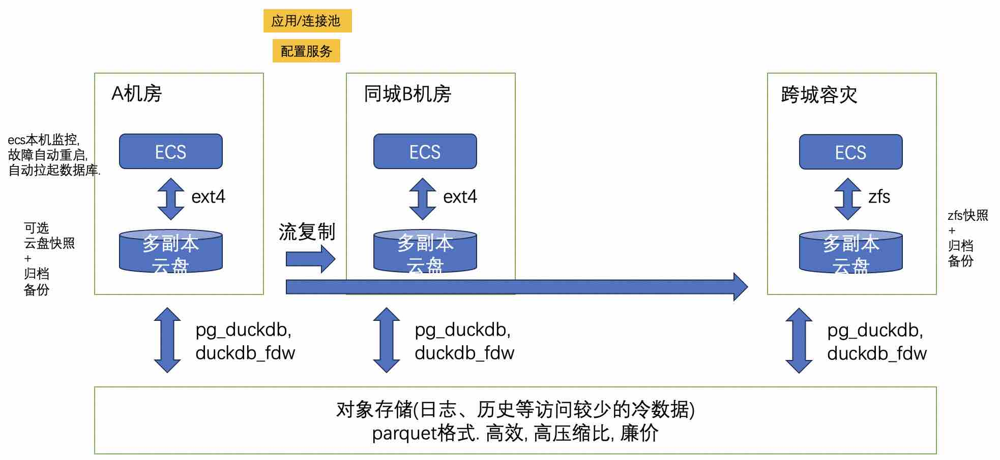

## 别搞HA,别搞HA,别搞HA! 续     
                                                                                
### 作者                                                    
digoal                                                    
                                                           
### 日期                                                         
2024-08-30                                                    
                                                        
### 标签                                                      
PostgreSQL , PolarDB , DuckDB , HA , 高可用 , 0丢失 , 崩溃恢复 , 云盘 , 多副本 , ECS , 机房故障 , 地震 , 跨城容灾 , zfs , 快照 , 克隆 , 备份 , 升级         
                                                                               
----                                                        
                                                                      
## 背景     
续 这一篇 [《DB吐槽大会,第47期 - PG 崩溃恢复能快点吗》](../202109/20210915_07.md)    
  
我想纠正一个观点, 数据库不是一定要搞主从HA的, 数据库不是一定要备份的, 数据库不是一定要搞双盘RAID1的. 搞主从HA之前先问问为什么吧?    
  
搞主从HA不就是要解决0丢失和快速崩溃恢复吗？咱直奔主题，别搞错了，HA不是目的，它只是手段 ！  
  
1、没有HA如何做到0丢失？  
  
0丢失很简单，不需要高端存储, 云盘的多副本技术随便就可以做到0丢失，还需要啥HA？实在很重要的数据搞个跨机房或者跨地域容灾实例子防天灾。  
  
2、没有HA如何做到瞬间崩溃恢复？  
  
瞬间崩溃恢复技术确实不简单，能做到任何时候崩溃恢复都无需等待，有这样的技术吗？沃特？还真做到了！PolarDB lazy recovery, 其实就是读page时同时读必要的wal进行恢复, 所以崩溃后数据库立即就对用户可用.  
  
如果是开源PostgreSQL呢? 也不用太担心. 除非你的shared buffer配置得特别大, 并且里面很多很多脏数据未持久化(基本上只有可能出现在业务高峰), 并且checkpoint周期特别长, 并且checkpoint target设置得很大(接近1). 这么多的并且合在一起, 概率就大大下降了. 所以即使是PG, 大概率崩溃恢复也是很快的.     
  
## 云上使用的数据库, 大多数时候不需要HA   
数据库流复制那种HA弊端太多, 毛病实在太多。老司机都难免翻车：  
- 成本至少翻一倍，  
- 异步的切来切去丢数据\脑裂，  
- 同步的性能损耗大\故障点增加\成本翻几倍，  
- 功能损失让人抓狂（逻辑槽支持不好，啥都要写wal等），  
- 版本管理插件管理配置管理更加复杂坑更多等等  
  
我推荐的省钱省事架构:    
- 主实例: 单机ecs + essd云盘 + ext4   (有容灾实例时, 不需要备份; 没有容灾实例时备份: 云盘快照+归档)      
- 可选 跨机房备用实例(异步流复制): 单机ecs + essd云盘 + ext4       
- 建议选择 跨地域容灾备份实例(异步流复制): 单机ecs + essd云盘 + zfs  (备份: zfs快照+归档)        
  
    
  
主实例故障怎么办?   
- 重启数据库或者重启ECS就可以了, 放心, 快得很. 比起流复制HA带来的弊端, ECS重启一次比切换慢个十几秒算啥?  故障又不是高频动作.     
  
机房故障怎么办?   
- 毕竟机房不是三天两头坏, 自动或人为切换都行. 根据你自己的业务对外的可用性承诺来判断, 如果本身要求不高的确认机房挂了一时半会起不来, 再考虑切换.     
  
如果是可用性要求特别高的业务, 面对机房故障, 就需要考虑跨机房高可用方案了, 这方面的产品特别多, 例如
- 中启乘数的clup, https://gitee.com/csudata/clup-community  ;   https://www.csudata.com/
- kubeblocks: https://github.com/apecloud/kubeblocks  
  
地震怎么办?   
- 确认无力回天了的话, 可以人为切到容灾实例, 毕竟地震概率很小.     
  
升版本怎么办?    
- 小版本升级, 安装好软件重启就可以, 快得很. 安全起见, 可以在升级前做个云盘快照.     
- 大版本升级, 本来就需要用备实例来演练, 在异地容灾的机器上克隆zfs快照进行演练, 成本低到不敢想象.     
   
一些最佳实践文章:   
- [《PostgreSQL 12 on 阿里云ecs 本地ssd VS essd pl3性能 - 含fio,fsync test,pgbench test，优缺点、云盘PG内核优化建议》](../201912/20191228_04.md)    
- [《PostgreSQL 11 1万亿 tpcb 性能测试 on 阿里云ECS + ESSD + zfs/lvm2条带 + block_size=32K》](../201809/20180919_01.md)    
- [《PostgreSQL 10 + PostGIS + Sharding(pg_pathman) + MySQL(fdw外部表) on ECS 部署指南(适合新用户) - 珍藏级》](../201710/20171018_01.md)    
- [《PostgreSQL on ECS多云盘的部署、快照备份和恢复》](../201708/20170812_01.md)    
- [《PostgreSQL 最佳实践 - 块级增量备份(ZFS篇)验证 - recovery test script for zfs snapshot clone + postgresql stream replication + archive》](../201608/20160823_09.md)    
- [《PostgreSQL 最佳实践 - 块级增量备份(ZFS篇)双机HA与块级备份部署》](../201608/20160823_08.md)    
- [《PostgreSQL 最佳实践 - 块级增量备份(ZFS篇)单个数据库采用多个zfs卷(如表空间)时如何一致性备份》](../201608/20160823_07.md)    
- [《PostgreSQL 最佳实践 - 块级增量备份(ZFS篇)备份集有效性自动校验》](../201608/20160823_06.md)    
- [《PostgreSQL 最佳实践 - 块级增量备份(ZFS篇)方案与实战》](../201608/20160823_05.md)    
- [《PostgreSQL 快速大版本升级多种方案 - 含重点介绍fast & safe upgrade to PostgreSQL 9.4 use pg_upgrade & zfs》](../201412/20141219_01.md)    
- [《如何创建RDS PG 的秒级 flashback闪回实例, 实时容灾实例 - zfs - snapshot - clone - standby - compress》](../202003/20200321_02.md)    
- [《ZFS PostgreSQL 调优》](../202009/20200910_01.md)    
  
    
