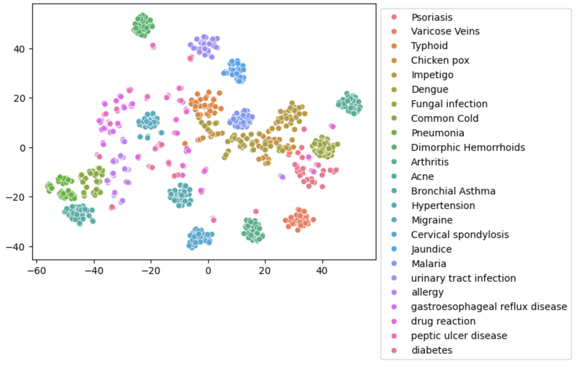

## 如何对高维向量进行可视化: T-SNE降维  
                                                                                
### 作者                                                    
digoal                                                    
                                                           
### 日期                                                         
2024-09-05                                                   
                                                        
### 标签                                                      
PostgreSQL , PolarDB , DuckDB , 大模型 , AI , 向量 , 降维 , 可视化 , 聚集 , 归类         
                                                                               
----                                                        
                                                                      
## 背景     
人类很难理解高维向量, 因为我们是3维生物. 但是计算机可以, 而且高维向量在计算机中应用广泛, 例如火热的大模型RAG应用, 需要讲图文、音视等内容转换为高维向量后计算机才能方便的根据语义检索相关的内容用于大模型的推理辅助.    
  
聚集是机器学习的常用功能, 也就是把同类聚集到一起, 如果要对图文、音视频进行聚集, 首先需要将其转换为向量值(俗称embedding过程), 对大量向量值进行非监督学习(通常采用k-mean算法)最后将数据分成N个集合. 然后我们还可以对每个集合进行打标, 例如对客户的评价文本进行聚集分析为3类, 然后可以对这三类进行打标: 满意、不满意、中等.    
  
与聚集功能相对的, 归类是大模型的常用功能之一, 例如根据病人的症状描述归类为什么病. 根据邮件内容归类是否为垃圾邮件.    
  
要评价聚集和归类的效果好不好, 通常可以使用可视化来实现.  
  
## 如何对高维向量进行可视化呢?   
  
前面说了人类很难理解高维向量, 但是好在可以降维.  T-SNE 是一种常见的降维算法. 可以参考阅读:    
  
https://blog.csdn.net/sinat_20177327/article/details/80298645  
  
https://zhuanlan.zhihu.com/p/64664346  
  
https://psubnwell.github.io/2017/12/01/paper-note-t-sne/  
  
https://jmlr.org/papers/volume9/vandermaaten08a/vandermaaten08a.pdf  
  
下面引用mistral文档中的一部分代码, 对病人的描述进行向量化后, 降维进行可视化.    
  
https://docs.mistral.ai/capabilities/embeddings  
  
```  
import seaborn as sns  
from sklearn.manifold import TSNE  
import numpy as np  
  
tsne = TSNE(n_components=2, random_state=0).fit_transform(np.array(df['embeddings'].to_list()))  
ax = sns.scatterplot(x=tsne[:, 0], y=tsne[:, 1], hue=np.array(df['label'].to_list()))  
sns.move_legend(ax, 'upper left', bbox_to_anchor=(1, 1))  
```  
  
得到这样的图表, 是不是很不错?     
  
   
  
  
