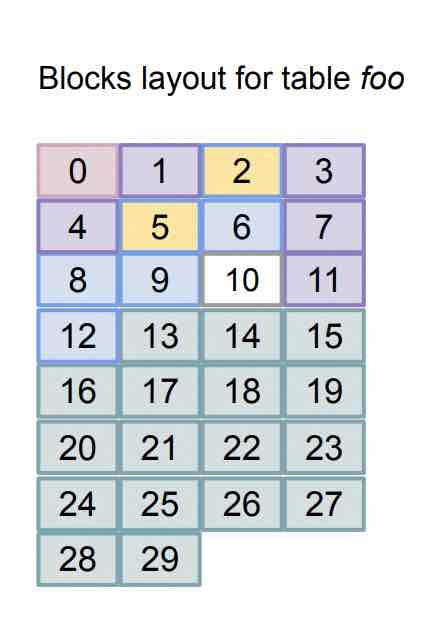
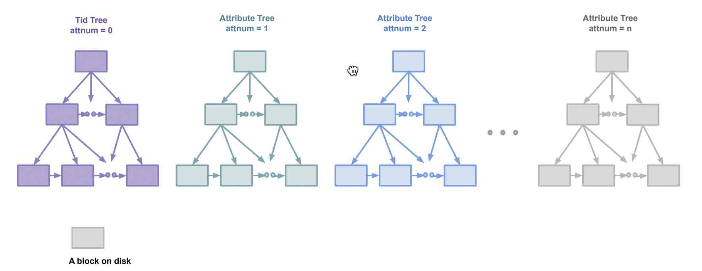
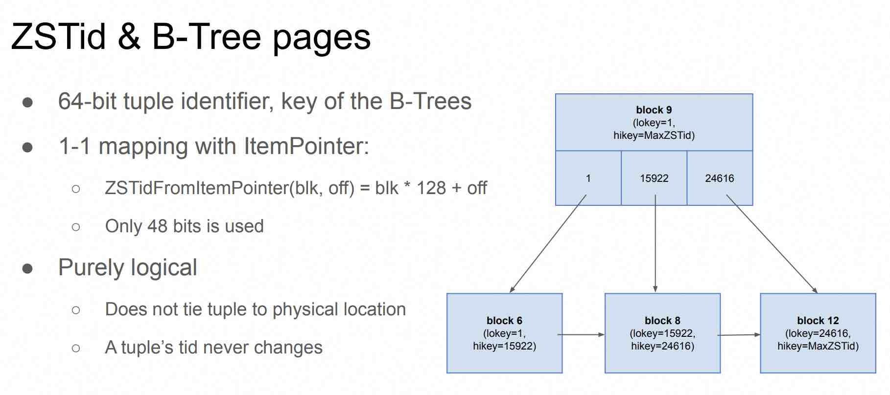
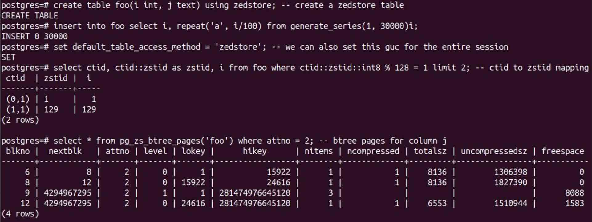
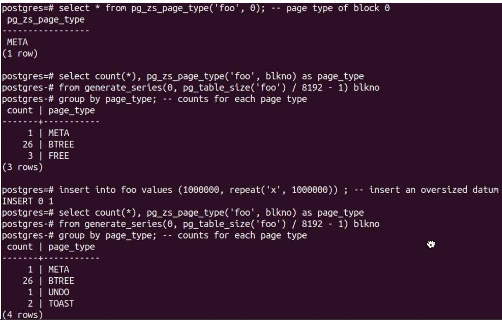
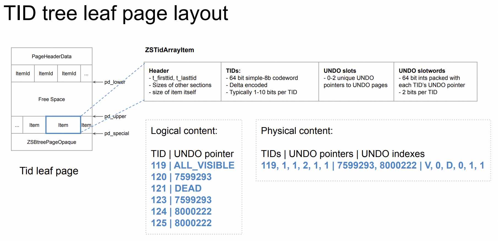
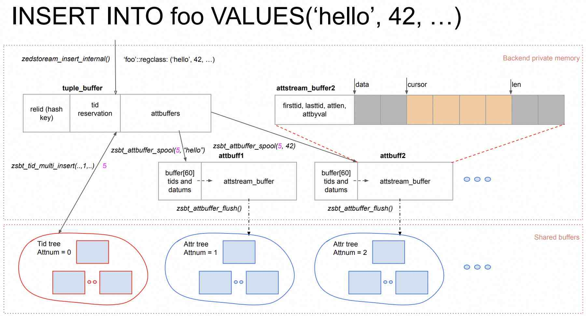
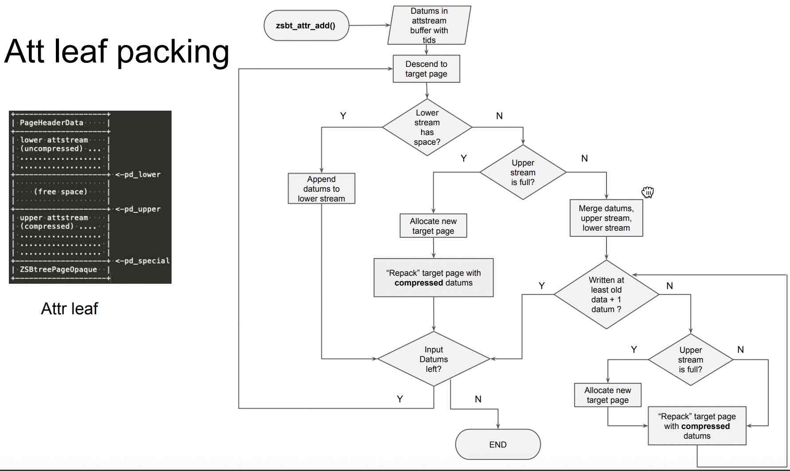
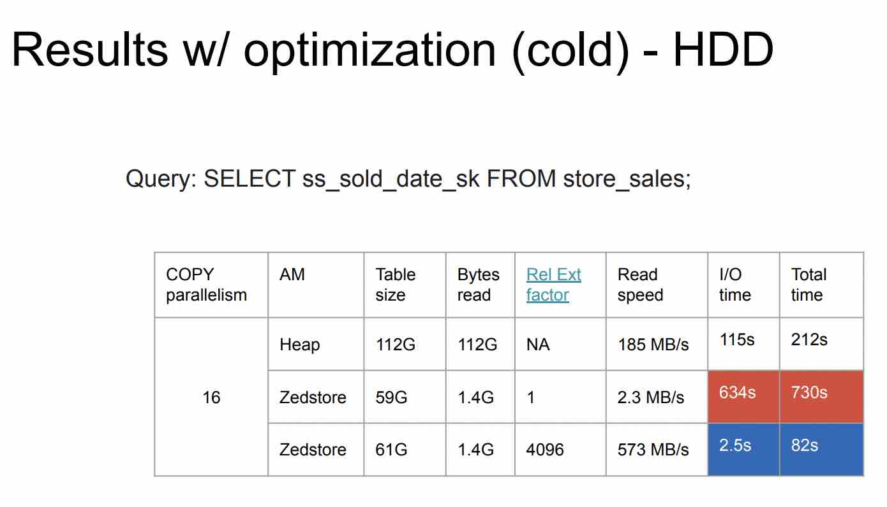
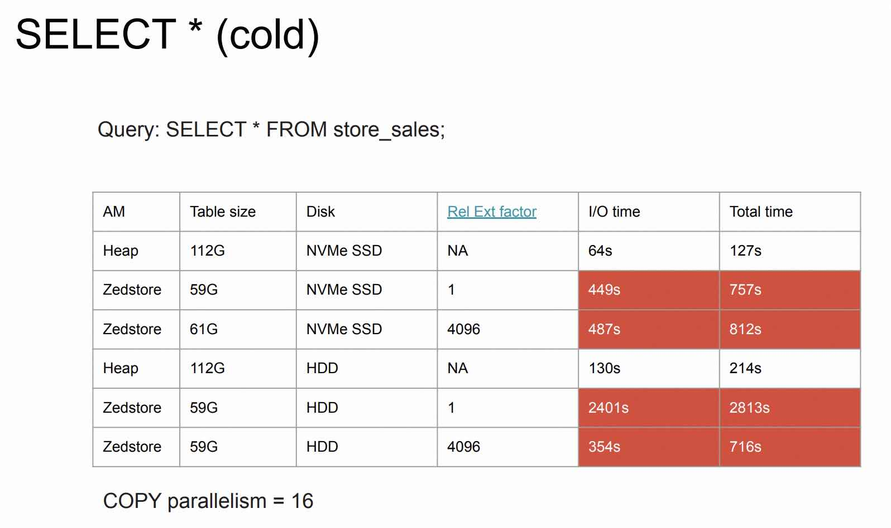

## 数据库筑基课 - 行列混存之 zedstore 表组织结构     
                                                                                      
### 作者                                                          
digoal                                                          
                                                                 
### 日期                                                               
2024-09-23                                                        
                                                              
### 标签                                                            
PostgreSQL , PolarDB , DuckDB , 应用开发者 , 数据库筑基课 , 表组织结构 , 行列混存 , zedstore    
                                                                                     
----                                                              
                                                                            
## 背景        
[《数据库筑基课 - 大纲》](../202409/20240914_01.md)      
    
<b>本节: 行列混存之 zedstore 表组织结构</b>     
    
## 简介  
zedstore 是来自greenplum(母公司为vmware时期) ( https://github.com/greenplum-db/postgres-archive/tree/zedstore/src/backend/access/zedstore ) 的开源行列混合存储引擎, zedstore的设计目标是要让PG/GP更好的满足HTAP(OLTP+OLAP)混合负载业务场景的诉求, 同时解决PostgreSQL内置heap存储引擎存在的一些问题(高频更新业务中可能引发的bloat、32bit xid wrap等).    
  
zedstore的设计目标:     
- 相比于按行存储的表, 按列存储可以提升查询少部分列的性能(扫描更少的page, 减少IO)。     
- 与按行存储的heap表相比，减少了磁盘占用(更短的tuple head, 同类数据拥有更高的压缩比)。    
- 按列存储, 在运算方面可以结合CPU 批量计算指令集, 提高运算性能.    
- 成为PostgreSQL的一种标准的table access method。  
- 完全MVCC兼容。    
- 支持PostgreSQL的所有索引类型。   
- 混合行列存储，引入column group理念, 例如 “a,b,c”三列经常一起查询, 可以将其存储在一起, “e,f,g,h,i,j”这几列经常一起查询, 可以将其存储在一起, 而其他列单独存储。     
- 避免额外的toast table(引入toast page type)。     
- 提供更好的控制膨胀(引入UNDO page type)。    
- 通过避免rewrite table表，更快地添加/删除列或更改列的数据类型。    
- 也可以实现按指定位置插入列, 逻辑上可以实现.   (强迫症患者的福音)      
  
1、file layout   
  
    
  
zedstore 将page分为几种类型    
- meta page , 0号页面, 存储了一些路由信息, 例如zstid tree、att tree的root page blockNum、每个 free page map list 的第一个page的blockNUM.       
- zstid btree page , 以zstid为key, 存储 zstid(逻辑行号) (多条打包存储, 采用zstid精确值+若干偏移量减少存储空间) , 以及tuples对应的undo points (包括tuple可见性).    
- att btree page / column group's page, 以zstid为key, 存储列的值(多条打包集合存储).     
- undo page , 仅zstid tree需要指向undo page/可见性. att tree不需要.     
- toast page , 仅att page需要指向toast page, 超级大的列需要.     
- free page , free page 采用list连接, 每个表有多个free page map list, 分别用于zstid、undo、每个att(含toast page).   meta page存储了每个list的第一个page的blockNUM.    
  
目前zedstore将所有的page都存储在表对应的1个数据文件中, 未来可能会将其分开, 例如按tid,att,undo,toast等单独存储在不同的数据文件中.    
  
2、tree(s) layout     
  
    
  
zedstore 使用tree来组织数据, 包括逻辑行号(zstid)、各个列(或column group)的数据.     
  
zstid 是一棵btree, 每一列(或column group)是一棵btree.    
  
3、meta page layout  
  
    
  
meta page 是 zedstore datafile的0号页面, 存储了一些路由信息, 例如zstid tree、att tree的root page blockNum、每个 free page map list 的第一个page的blockNUM.     
  
注意在图中未区分不同的free page map list, 但是在代码中有说明“采用了不同的list”.      
  
4、zstid btree layout    
  
    
  
zstid代表了逻辑行号, 对于表的一条记录来说, 如果不发生update zstid永远不会改变, 并且zstid在一张表里面是唯一的. 但是update后可能发生变化, 或者delete后并vacuum后未来的tuple可能复用已删除的zstid, 所以不要把zstid当PK来使用. 为了能兼容PG原来的tid的接口, zstid可以和ctid相互1对1的进行转换: `zstid = ctid.blknum*128 + ctid.offset`    
  
注意, 图中的block ID不是ctid里的blknum, 而是zedstore datafile里的block NUM.      
  
观察:   
  
    
  
    
  
  
5、zstid page layout   
  
    
  
zstid page 内部:    
- zstid(逻辑行号)连续多条打包存储(delete/update后可能存在gap), 采用Simple-8b格式(zstid精确值+若干偏移量)减少存储空间.    
- 同时还存储了tuples对应的undo points (包括tuple可见性).    
  
格式如下  
```  
Header  |  1-16 TID codewords | 0-2 UNDO pointers | UNDO "slotwords"  
```  
  
详见  
- https://github.com/greenplum-db/postgres-archive/blob/zedstore/src/include/access/zedstore_internal.h  
  
6、att(s) page layout    
  
    
  
zstid btree 和 att(s) btree 的key 都是zstid, 但是它们存的value不一样:    
- zstid leaf page的value存储了该逻辑行的可见性、undo point.  (注意物理结构是多条打包, 类似vops的瓦片式存储)    
- att(s) leaf page的value存储了该列的值、或toast point.  (注意物理结构是多条打包, 类似vops的瓦片式存储)    
  
注意每个page 又包含了2个stream部分  
- lower attstream (uncompressed), 当插入数据时, 写入到uncompressed的部分, 直到page写满, 会触发压缩, 将uncompressed和compressed一起压缩后, 替换compressed的部分 (大范围压缩以提高整体压缩比). 空出来的uncompressed部分又可以继续写入, 直到不能压缩后都没有空间为止.    
- upper attstream (compressed)   
  
详见  
- https://github.com/greenplum-db/postgres-archive/blob/zedstore/src/include/access/zedstore_internal.h  
  
观察:  
  
    
  
7、插入  
  
    
  
先分配zstid并写入zstid tree, 然后使用该zstid作为key, column value作为value写att btree page.    
  
8、查询  
  
    
  
先扫描zstid tree, 过滤不可见的tuple, 然后根据要查询的column扫描对应的att tree.      
  
9、删除/更新  
  
只需要修改zstid tree, 标记删除的行. vacuum时扫描zstid tree, 并清理dead zstid对应的所有att tree后, 该dead zstid才能被复用.      
  
更新操作相当于delete+insert.    
  
10、packing att btree page uncompressed chunks 逻辑   
  
    
  
图中描述了数据写入到att tree leaf page时的流程, 优先写入page中uncompress的部分(提高写入速度), 如果写满了则触发压缩的逻辑.    
  
11、索引  
  
与MySQL 索引组织表的二级索引类似, 给zedstore的表创建索引时, key为索引字段/表达式的值, value为zstid.   使用索引扫描时回zstid tree检查tuple可见性和版本, 回att tree获取想要查询的字段值.    
  
## 优势 & 适合场景    
从zedstore的设计目标、原理来看, 它可能会比较适合HTAP(OLTP+OLAP)混合负载业务场景, 两者均可兼顾. 兼顾就意味着平庸, 两者都要做到拔尖的话可能会比较难, 除非有天才设计师出现.  
  
从当前已发布的测试数据可以看出, 对比pg内置的heap, zedstore在批量导入性能、压缩比、查询少量列的大量数据的性能都更优秀.   
  
    
  
    
  
  
  
## 劣势 & 不适合场景    
由于zstid和每一列都采用B树组织, 数据块可能比较离散, seq scan或大范围扫描较多条数据时, 在HDD硬盘上体现为随机IO访问, 性能较差.   
  
    
  
zedstore目前的版本进行了一些优化:  
- 使用block预分配(zedstore_rel_extension_factor), 使得leaf pages物理上更加连续. (PS: 在经过大量的更新、或在大并发数据导入的情况下, “seq scan或大范围扫描较多条数据时产生大量随机IO访问”问题可能依旧存在).    
  
    
  
zedstore不适合大量查询很多列的场景, 因为要扫描很多个att btree.  
  
    
  
  
## DEMO     
  
略  
  
## 扩展问题     
  
## 扩展阅读     
- [PPT](20240923_01_doc_001.pdf): https://www.pgcon.org/events/pgcon_2020/sessions/session/44/slides/13/Zedstore-PGCon2020-Virtual.pdf  
- 开源项目: https://github.com/greenplum-db/postgres-archive/tree/zedstore  
- 开源项目: https://github.com/postgrespro/vops   
- 代码: https://github.com/greenplum-db/postgres-archive/tree/zedstore/src/backend/access/zedstore  
- 代码: https://github.com/greenplum-db/postgres-archive/blob/zedstore/src/include/access/zedstore_internal.h  
- 代码: https://github.com/greenplum-db/postgres-archive/blob/zedstore/src/backend/access/zedstore/zedstore_inspect.c  
- blog: [《PostgreSQL 向量化执行插件(瓦片式实现-vops) 10x提速OLAP》](../201702/20170225_01.md)    
- blog: https://blogs.vmware.com/opensource/2020/07/14/zedstore-compressed-columnar-storage-for-postgres/  
  
  
#### [期望 PostgreSQL|开源PolarDB 增加什么功能?](https://github.com/digoal/blog/issues/76 "269ac3d1c492e938c0191101c7238216")
  
  
#### [PolarDB 开源数据库](https://openpolardb.com/home "57258f76c37864c6e6d23383d05714ea")
  
  
#### [PolarDB 学习图谱](https://www.aliyun.com/database/openpolardb/activity "8642f60e04ed0c814bf9cb9677976bd4")
  
  
#### [PostgreSQL 解决方案集合](../201706/20170601_02.md "40cff096e9ed7122c512b35d8561d9c8")
  
  
#### [德哥 / digoal's Github - 公益是一辈子的事.](https://github.com/digoal/blog/blob/master/README.md "22709685feb7cab07d30f30387f0a9ae")
  
  
#### [About 德哥](https://github.com/digoal/blog/blob/master/me/readme.md "a37735981e7704886ffd590565582dd0")
  
  

  
