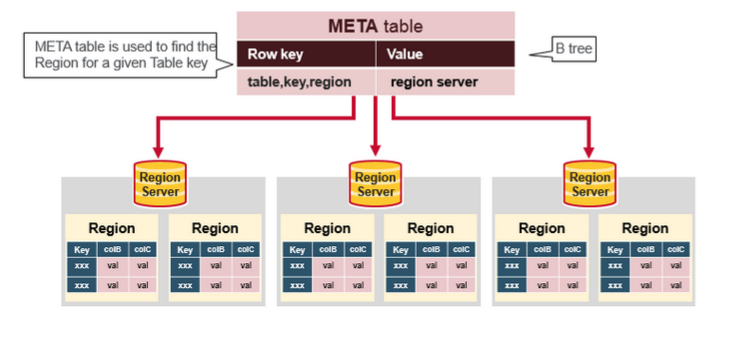

## 数据库筑基课 - HBase HStore 列簇存储   
                                                                                        
### 作者                                                            
digoal                                                            
                                                                   
### 日期                                                                 
2024-11-07                                                 
                                                                
### 标签                                                              
PostgreSQL , PolarDB , DuckDB , 应用开发者 , 数据库筑基课 , 表组织结构 , hstore , hbase , 列簇          
                                                                                       
----                                                                
                                                                              
## 背景          
[《数据库筑基课 - 大纲》](../202409/20240914_01.md)        
      
<b>本节: HBase HStore 列簇存储</b>         
      
## 简介    
  
HStore是HBase的组件之一, 用于存储HBase列簇的数据. 每个HStore包含1个memstore和0或多个storefile, 随着数据量的增加而变化. HBase通过type(put/delete)表示插入和删除操作, 通过ts表示一条记录的版本, 所以HStore还有垃圾回收的动作, 在达到一定阈值时触发, 收缩旧的版本、压缩存储.     
  
1、逻辑&物理结构:  
  
     
  
2、记录结构:   
  
     
  
3、region server 结构:   
  
     
  
     
  
4、region 结构:   
  
     
  
5、Hfile内部结构:  
- Data：数据块，保存表中的数据（可被压缩）  
- Meta（Optioal）：元数据块，保存用户自定义的 kv 对（可被压缩）  
- FileInfo：HFile的元数据信息，用户也可以在这一部分添加自己的元信息。  
- Data Index：存储Data块索引信息的块文件，每条索引的key 是被索引的 block 的第一条记录的 key。  
- Meta Index：存储Meta块索引信息的块文件  
- Trailer：它存储了FileInfo、DataIndex、MetaIndex块的偏移值和寻址信息。  
  
     
  
  
6、术语:  
- table : 表     
- column family : 列簇, 设计schema时一些关联性较强的字典可以归到一个列簇里, 例如个人信息(姓名、年龄、职业、...)     
- column qualifier : 列限定符, 例如上面提到的姓名、年龄、职业分别是列簇个人信息里面的3个列限定符号.    
- column : HBase的列由列簇:列限定符组成, 是列的最小单位.    
- type : 操作类型, 注意这个不是指数据类型. 操作类型包括put、delete, 代表插入操作、删除操作.    
- ts : 时间戳, 每条记录的生成时间, 或者由客户端生成的时间. 通常代表记录的多版本. 在hfile中同一条记录的多个版本按ts倒序存储(排序: rowkey, column family, column qualifier, type, ts desc), 最新的代表当前版本.     
- cell : KV表达的最小单元格. cell也可以理解为某个KV对: `K "rowkey, column family, column qualifier, type, ts" : V "value"`    
- rowkey : 顾名思义, 行标识. 同一行数据应包括: 一条记录的所有column family、所有column qualifier、所有type(put/delete)、所有版本(ts)    
- 字典序: rowkey在hfile,region中按字典序排序.    
- region server : 存储服务器, region的载体.    
- region : 每个表最开始只需要1个region, 随着数据量的增加, 可能会分配出多个region. 同一个region只存储在某一个region server中.  每个region通过startrowkey,stoprowkey来表示该region存储的rowkey范围.    
- hstore : hstore用于存储HBase列簇的数据, 1个hstore只存储1个列簇的数据. 每个HStore包含1个memstore和0或多个storefile(hfile).     
- memstore : 为了提高写入速度设计的写缓存结构(默认128M), 每个hstore对应1个memstore, 存储未写入hfile的数据, memstore的数据排序: rowkey, column family, column qualifier, type, ts desc 后异步的写入hfile中, 所以hstore内的hfile会越来越多.    
- hfile : hstore的持久化存储  
- blockcache : region server层面统一管理, 读缓存  
- hlog : region server层面统一管理, 一个region server一组hlog. 数据写入memstore前, 先写hlog(wal), 即预写日志, 如果region server崩溃, 可用于恢复memstore未持久化的数据.    
  
  
  
7、数据写入流程:  
- 1、客户端向region server提交写请求  
- 2、region server找到目标region  
- 3、region 检查数据是否与schema一致  
- 4、如果客户端没有指定版本(ts), 则获取当前系统时间作为数据版本  
- 5、将更新写入wal (hlog)  
- 6、将更新写入memstore  
- 7、判断memstore存储是否已满, 如果存储已满则需要flush为hfile.   
  
8、数据读取流程:   
  
数据读取有几种可能(HBase默认情况下没有二级索引, 但是可以通过其他组件异步构建二级索引.)  
- 1、rowkey 精确查找  
- 2、rowkey range 查找  
- 3、rowkey prefix like 查找(也类似range 查找)  
- 4、全表扫描  
    
如果提供了rowkey则采取如下流程读取:   
    
     
    
以下是客户端首次读写 HBase 上数据的流程:     
- 1、客户端从 Zookeeper 获取 META 表所在的 Region Server；  
- 2、客户端访问 META 表所在的 Region Server，从 META 表中查询到访问rowkey所在的 Region Server，之后客户端将缓存这些信息以及 META 表的位置；  
- 3、客户端从rowkey所在的 Region Server 上获取数据。  
    
如果再次读取，客户端将从缓存中获取rowkey所在的 Region Server。这样客户端就不需要再次查询 META 表，除非 Region 移动导致缓存失效，这样的话，则将会重新查询zookeeper并更新缓存。  
    
注: META 表是 HBase 中一张特殊的表，它保存了所有 Region 的位置信息，META 表自己的位置信息则存储在 ZooKeeper 上。  
    
## 优势 & 适合场景     
1、结构特点: 列簇存储  
  
HBase中的数据是按照列簇存储的，即将数据按照列簇分别存储在不同的Store file中。在Store file内, 数据又按"rowkey, column family, column qualifier, type(put/del), ts desc"排序存储, 这样的存储结构适合什么场景? 不适合什么场景?    
  
列簇存储和行存、列存不太一样, 有点像行列混合存储. 另一个行列混合存储的代表是zedstore: [《数据库筑基课 - 行列混存之 zedstore 表组织结构》](../202409/20240923_01.md)     
  
行式存储在获取一行数据时是很高效的，但是如果某个查询只需要读取表中指定列对应的数据，那么行式存储会先取出一行行数据，再在每一行数据中获取目标列。这种处理方式在查找过程中引入了大量无用列信息，从而导致大量内存占用。也无法利用cpu的批量计算指令, 在处理大量数据时效率较低.     
  
列式存储对于只查找某些列数据的请求非常高效，只需要连续读出所有待查目标列，然后遍历处理即可；但是反过来，列式存储对于获取一行的请求就不那么高效了，需要多次IO读多个列数据，最终合并得到一行数据。另外，因为同一列的数据通常都具有相同的数据类型，因此列式存储具有天然的高压缩特性。同时列式存储由于类型一致可以利用cpu的批量计算指令, 在处理大量数据时效率较高.    
  
列簇式存储介于行式存储和列式存储之间，通过不同的设计思路在行式存储和列式存储两者之间相互切换。一张表只设置一个列簇，这个列簇包含所有用户的列。HBase中一个列簇的数据是存储在一起的，这种设计模式就等同于行式存储。一张表设置大量列簇，每个列簇下仅有一列，这种设计模式就等同于列式存储。  
  
2、存储特点: rowkey自我控制、有序、密集存储.    
  
3、其他  
- 容量巨大：HBase的单表可以支持千亿行、百万列的数据规模，数据容量可以达到TB甚至PB级别。  
- 良好的可扩展性：增加Region Server节点实现计算层的扩展，增加DataNode实现存储扩展。  
- 稀疏性：HBase支持大量稀疏存储，即允许大量列值为空，并不占用任何存储空间。可以上百万列.   
- 多版本：HBase支持多版本特性，即一个KV可以同时保留多个版本。  
- 支持过期：HBase支持TTL（ Time To Live）过期特性，用户只需要设置过期时间，超过TTL的数据就会被自动清理，不需要用户写程序手动删除。  
  
  
主要擅长于OLTP场景，数据写操作性能强劲，对于随机单点读以及小范围的扫描读，其性能也能够得到保证。对于大范围的扫描读可以使用MapReduce提供的API，以便实现更高效的并行扫描。  
  
基于rowkey自我控制、有序、密集存储的特性, 也适合于时序场景/物联网场景, 例如一次捞取一个车辆的所有轨迹, 一个传感器一天的所有记录, 这些记录如果rowkey一致那么是密集存储在少量数据块内的, 可以高效的读取.    
  
在PG数据库heap表架构下这类场景的优化思路与之类似, 也是要将分散在多个block内的记录聚合到一起存储减少IO. 而HBase天然就是这样.  例如:     
- [《重新发现PostgreSQL之美 - 8 轨迹业务IO杀手克星index include(覆盖索引)》](../202105/20210530_02.md)    
- [《PostgreSQL IoT，车联网 - 实时轨迹、行程实践 2 - (含index only scan类聚簇表效果)》](../201812/20181209_01.md)     
  
## 劣势 & 不适合场景      
  
HBase本身不支持很复杂的聚合运算（如Join、GroupBy等）。如果业务中需要使用聚合运算，可以在HBase之上架设Phoenix组件或者Spark组件，前者主要应用于小规模聚合的OLTP场景，后者应用于大规模聚合的OLAP场景。  
  
HBase本身并没有实现二级索引功能，所以不支持二级索引查找。可以使用Phoenix提供的二级索引功能。  
  
HBase原生不支持全局跨行事务，只支持单行事务模型。可以使用Phoenix提供的全局事务模型组件来弥补HBase的这个缺陷。  
  
  
## DEMO      
略.    
  
## 扩展问题       
  
  
1、rowkey的设计原则?  
- 贴合业务设计/组合设计原则, 容易根据业务需求构造rowkey的值便于未来检索. 查询频率较高的查询条件组合成rowkey/rowkey的前缀  
- 唯一性原则, 每一行的rowkey建议唯一. (同一行数据应包括: 一条记录的所有column family、所有column qualifier、所有type(put/delete)、所有版本(ts))    
- 散列原则, 因为每个hstore内rowkey按字典序存储, 如果rowkey是有序的, 那么一个小的时间窗口内的时间都会写入到同一region、也就是同一region server, 成为热点. 容易造成写入瓶颈. 散列可以避免这个问题.  
- 长度原则, 满足业务需求的情况下越短越好, 节省空间.  
  
  
  
## 扩展阅读    
  
Class HStore: https://hbase.apache.org/devapidocs/org/apache/hadoop/hbase/regionserver/HStore.html  
  
深入理解HBase存储结构: https://blog.csdn.net/f1550804/article/details/88380764  
  
HBase系统架构及数据结构: https://blog.csdn.net/weixin_42073629/article/details/109253132  
  
HBase介绍、数据模型、体系结构: https://blog.csdn.net/Shyllin/article/details/124386524  
  
HBase索引概念(含二级索引): https://blog.csdn.net/qq_46893497/article/details/114198695  
  
大白话彻底搞懂 HBase Rowkey 设计和实现方式: https://xie.infoq.cn/article/3f8918d3ef064b7b6b2382e1b  
  
大白话彻底搞懂 HBase Rowkey 设计和实现方式: https://blog.csdn.net/csdnnews/article/details/106152694  
  
字典序: https://baike.baidu.com/item/%E5%AD%97%E5%85%B8%E5%BA%8F/7786229  
  
