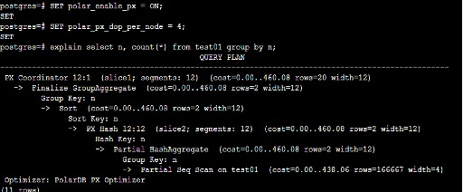
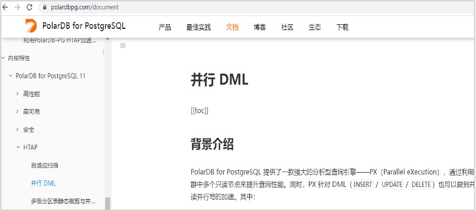
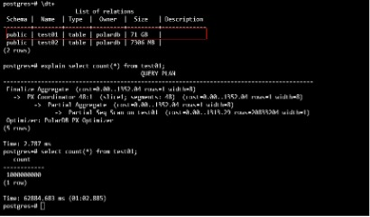
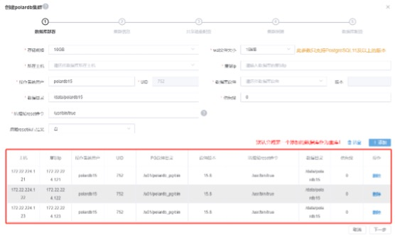

## PolarDB & PG 专家训练营回顾 | 《PolarDB国产开源数据库进阶》文字稿   
                                                                                     
### 作者                                                                          
digoal                                                                            
                                                                                            
### 日期                                                                                          
2024-12-04                                                        
                                                   
### 标签                                                                        
PostgreSQL , PolarDB , DuckDB , 数据库训练营        
                                                                                                                
----                                                                                         
                                                                                                       
## 背景    
2024年11月29日, 由PolarDB社区联合PostgreSQL社区发起的《国产开源数据库PolarDB+PostgreSQL专家训练营》在北京站正式开课。PolarDB社区及PostgreSQL中文社区的多位核心成员汇聚上地国际人才会客厅会议室，为大家带来为期一天的技术盛宴，和大家一起分享PolarDB和PostgreSQL数据库知识，除了技术分享，大家还参与了热烈的交流讨论、实验、考试和颁证等环节。    
    
    
  
回顾:     
- [《PolarDB & PG 专家训练营回顾 | 《数据库筑基》文字稿》](../202412/20241203_01.md)    
    
下面是唐成老师分享议题《PolarDB国产开源数据库进阶》的文字稿。    
    
# 唐成 - 《PolarDB国产开源数据库进阶》    
本次PolarDB数据库专题分享直击核心，概述了其作为国产化PostgreSQL的独特地位、官方资源获取、非共享与共享存储策略、四大核心优势（完全兼容PostgreSQL、超低延迟只读节点、平稳性能优化、秒级只读节点扩展）、两大创新功能（跨节点并行处理、并行DML）、高可用性与数据备份策略、性能测试数据（百万级QPS、高读吞吐）及广泛应用场景，同时提供了详尽的部署指南与现场演示，解决了依赖问题。以下是演讲内容：  
  
## 1 PolarDB数据库定义与官方网站资源介绍  
### 1.1数据库PolarDB定义  
- 是一个增强的PostgreSQL数据库  
- 是一款国产化数据库  
    - 安全可靠测评结果公告（2023年第1号）: http://www.itsec.gov.cn/aqkkcp/cpgg/202312/t20231226_162074.html      
  
### 1.2 PolarDB的网站  
- https://www.openpolardb.com  
- https://polardbpg.com/home  
- https://apsaradb.github.io/PolarDB-for-PostgreSQL/zh/  
- https://github.com/ApsaraDB/PolarDB-for-PostgreSQL  
- https://github.com/ApsaraDB/PolarDB-FileSystem  
  
## 2 PolarDB的两种部署方式及共享存储架构优势  
  
### 2.1 PolarDB的两种部署方式  
- 非共享存储部署（当成PostgreSQL数据库使用）  
- 基于共享存储的部署  
  
### 2.2 国产化数据库PolarDB共享存储的架构  
共享存储架构的最大特点是流复制的主备库可以共享一份数据。  
  
  
   
## 3 PolarDB的特点与亮点功能解析  
  
### 3.1 国产化数据库PolarDB的特点  
  
- 与PostgreSQL完全兼容：PolarDB完全与PostgreSQL兼容，包括SQL的语法、第三方的插件等等。  
- 只读节点延迟低：PostgreSQL数据库的流复制备节点，需要应用日志，而基于共享存储的PolarDB数据库的只读节点与主库共享存储，无需应用日志。所以延迟非常低。  
- 性能更平稳：PolarDB相对PostgreSQL做了一些优化，性能更高。基于共享存储的PolarDB不在依赖文件系统缓存，运行更平稳。  
- 秒级增加只读节点：PostgreSQL增加流复制备库，需要复制整个数据库的数据，时间通常在半个小时到数个小时之间。而使用PolarDB可以在数秒内建立一个只读节点  
- 大库在线扩容：存储计算分离的架构，数据库的大小不在受控于本地磁盘的空间大小。可在线快速扩容。  
  
### 3.2 国产化数据库PolarDB亮点功能：跨节点并行  
开启跨节点并行：一个大查询可以并行的在多台机器上运行。  
```  
ALTER TABLE test01 SET(px_workers=100);  
SET polar_enable_px = ON;  
SET polar_px_dop_per_node = 4;  
```  
  
  
   
### 3.3 国产化数据库PolarDB亮点功能：并行DML  
  
详细参加：https://polardbpg.com/document  
  
  
   
## 4 PolarDB的高可用性与备份方案  
  
### 4.1 PolarDB高可用实现  
<b>非共享存储架构：</b> 使用PostgreSQL的流复制高可用方案。如CLup、Patroni等等。  
  
<b>共享存储架构：</b> 主库出现故障后,把只读节点提升为主库即可。原主库的机器恢复后,转换为备库。  
  
### 4.2 PolarDB的备份  
使用pg_basebackup：  
  
在PolarDB中pg_basebackup，PolarDB中的pg_basebackup实际上是一个链接文件，指向polar_basebackup  
  
## 5 PolarDB在不同使用场景下的应用与表现  
  
### 5.1 PolarDB之高性能  
  
  
Dell R730 Intel(R) Xeon(R) CPU E5-2630 v4 @ 2.20GHz  
  
71GB的10亿条记录的表(走磁盘），全表扫描，时间63s  
  
### 5.2 PolarDB使用场景之高性能  
- 百万QPS场景。  
- 几十GB/S的读吞吐场景。  
- 难以做分库分表的高性能复杂业务，支持复杂的SQL。  
  
### 5.3 PolarDB使用场景之强一致性场景  
<b>数据强一致性保证，满足金融级可靠性要求</b>  
  
金融场景下对业务要求高可用和强一致性，PolarDB采用存储和计算分离的架构，支持秒级的故障恢复、全局数据一致性和数据备份容灾等功能，充分满足金融级合规可靠性要求  
  
集群版采用共享分布式存储的设计，彻底解决了主从（Master-Slave）异步复制所带来的备库数据非强一致性的问题。  
  
### 5.4、PolarDB使用场景之大容量场景  
数据仓库  
  
PB级数据量  
  
## 6 PolarDB的部署要求与实际操作演示  
  
### 6.1 部署PolarDB的要求  
安装要求：  
- 需要有共享盘：盘的大小需要大于等于20GB  
- 操作系统：CentOS7.X、Rhel/RockyLinux 8.X、Rhel/RockyLinux 9.X  
- 2台以上物理机或虚拟机，内存要求大于4GB  
  
### 6.2 PolarDB共享存储架构的部署要求  
  
需要一块共享盘：云上可以使用弹性共享盘。云下可以使用SAN存储或iSCSI共享盘，或一些商业的共享盘。如乘数科技一体机中的ESDisk。  
- 盘要求有路径：/dev/nvmeXnY   
- 如果盘的名称不是这样的，可以使用udev规则建一个这样的链接  
- 高可用需要VIP  
  
### 6.3 PolarDB软件下载  
下载地址：  
- https://www.openpolardb.com/download  
- https://github.com/ApsaraDB/PolarDB-for-PostgreSQL/releases  
  
  
  
### 6.4 演示PolarDB单机版本部署  
安装：  
```  
rpm -ivh PolarDB-15.8.2.0-f3737b0b.el8.x86_64.rpm  
```  
  
此软件包安装到目录：`/u01/polardb_pg`  
  
  
创建单机数据库：与PostgreSQL一样，然后用`initdb`创建数据库：  
```  
initdb  
```  
  
配置数据库参数`postgresql.conf`:  
```  
listen_addresses = '*'  
port = 6752  
max_connections = 2000  
max_prepared_transactions = 2000  
shared_buffers = 20MB  
max_wal_size = 3GB  
min_wal_size = 2GB  
archive_mode = on  
archive_command = '/bin/true'  
logging_collector = on  
```  
  
默认创建的数据库的WAL文件大小是1GB  
  
缺依赖包的错误：  
```  
error while loading shared libraries: libunwind.so.8: cannot open shared object file: No such file or directory  
  
error while loading shared libraries: libxerces-c-3.2.so  
```  
  
解决方法：  
```  
yum install libunwind  
yum install xerces-c  
```  
  
### 6.5 演示PolarDB 共享存储版本的部署  
按单机版本的安装方法，在3台虚拟机器上安装好PolarDB软件。这三台机器如下：  
- 172.22.224.121  
- 172.22.224.122  
- 172.22.224.123  
  
操作系统为Rocky Linux 8.9。  
  
通常的虚拟机平台都有共享盘的功能，我们为这三台机器增加一块共享盘，在我们的这个环境中共享盘为`/dev/sda`，通常PolarDB共享盘的名称希望是`nvmeXXX`开头的，为此我们增加一个`udev`规则文件`/etc/udev/rules.d/pfs_disk.rules`为`/dev/sda`建立一个链接文件`/dev/nvme1n1`。`udev`规则文件`/etc/udev/rules.d/pfs_disk.rules`的内容如下：  
```  
ACTION=="add|change", SUBSYSTEMS=="block", ENV{ID_PATH}=="pci-0000:00:03.0-scsi-0:0:4:0" SYMLINK+="nvme1n1"  
```  
  
注意上面的`“pci-0000:00:03.0-scsi-0:0:4:0”`，可以通过`ls -/dev/disk/by-path`看到：  
  
  
  
由于基于共享存储的PolarDB数据库集群的创建步骤比较多，我们使用PolarDB的第三方管控平台CLup在WEB界面中创建此集群。此管控平台安装在172.22.224.120。  
  
CLup管控平台的安装方法请见：https://www.csudata.com/clup/manual/5.x/10147   
  
CLup管控平台的安装方法比较简单，这里就不在赘述。  
  
我们进入CLup管控界面中，创建PolarDB集群：  
  
  
   
出现创建PolarDB集群的界面：  
  
  
   
输入类似上面的类似上面的内容，然后点按钮“添加”，就添加了一台机器，重复这个步骤，可以添加多台机器：  
  
  
   
然后点下一步：  
  
  
   
然后点下一步，进入配置共享盘的界面：  
  
  
   
在上面的界面中输入我们之前配置好的共享盘：`/dev/nvme1n1`，然后点“检测”，出现：  
  
  
   
上面的`polar_datadir`是指在共享盘内部的一个子目录，保持默认即可。而`pfsdaemon_params`的值`“-w 2”`是指定`pfs`的`IO`工作线程数，演示环境IO工作线程数为2就够了。而如果是生产环境可以多一些，如`“-w 8”`，IO工作线程数越多，IO性能越好（消耗的CPU也越多）。  
  
点上面的“格式化”按钮，相当于给共享盘做文件系统的格式化。格式化后，点下一步即可，后续的界面保持默认即可，最后出现一个创建集群的界面：  
  
  
   
然后我们进入172.22.224.121机器上，可以登录数据库了：  
```  
[root@clup1 rules.d]# su - polardb15  
[polardb15@clup1 ~]$ psql postgres  
psql (PostgreSQL 15.8 (PolarDB 15.8.2.0 build f3737b0b) on x86_64-linux-gnu)  
Type "help" for help.  
  
postgres=#   
```  
  
创建完成后，注意观察备库的`postgresql.conf`配置：  
```  
polar_storage_cluster_name = 'disk'  
shared_preload_libraries = 'polar_vfs,polar_worker,pg_stat_statements'  
logging_collector = on  
log_line_prefix = '%p   %r      %u      %m      '  
log_directory = 'pg_log'  
log_destination = 'stderr'  
listen_addresses = '*'  
max_connections = 1000  
wal_keep_size = '1GB'  
full_page_writes = on  
min_wal_size = '320MB'  
max_wal_size = '1GB'  
polar_vfs.localfs_mode = off  
polar_enable_shared_storage_mode = on  
port = 6752  
polar_hostid = 1  
polar_disk_name = 'nvme1n1'  
polar_datadir = '/nvme1n1/shared_data/'  
polar_replica='on'  
recovery_target_timeline='latest'  
primary_slot_name='csu_replica46'  
primary_conninfo='user=polardb15 host=172.22.224.121 port=6752 sslmode=prefer sslcompression=0 application_name=172.22.224.122'  
```  
  
### 6.6 演示PolarDB 共享存储版本 主备库手工高可用切换  
在CLup环境中：  
  
  
   
在上图中点“切换为主库”按钮，即可以完成主备库切换。  
  
更多信息可参考CLup管控平台的手册:    
- https://www.csudata.com/clup/manual/5.x/10147   
- https://www.csudata.com/clup/manual/5.x/10173  
     
